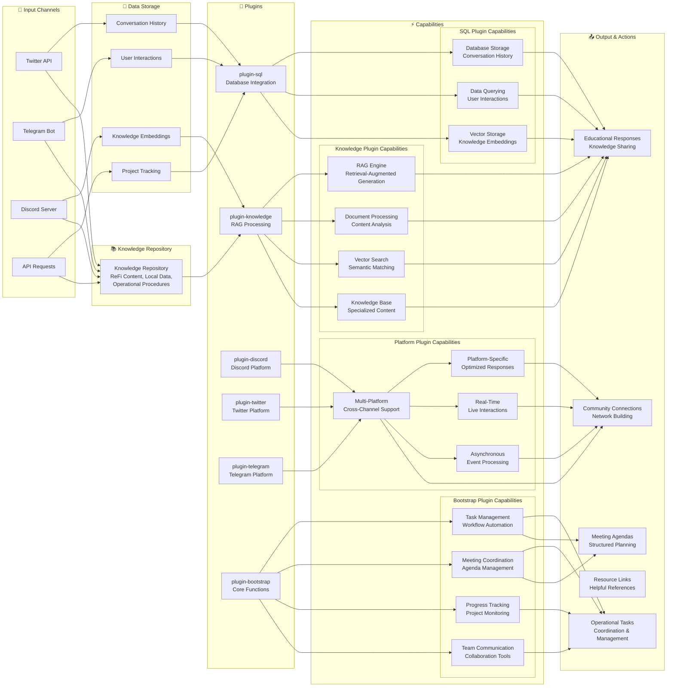
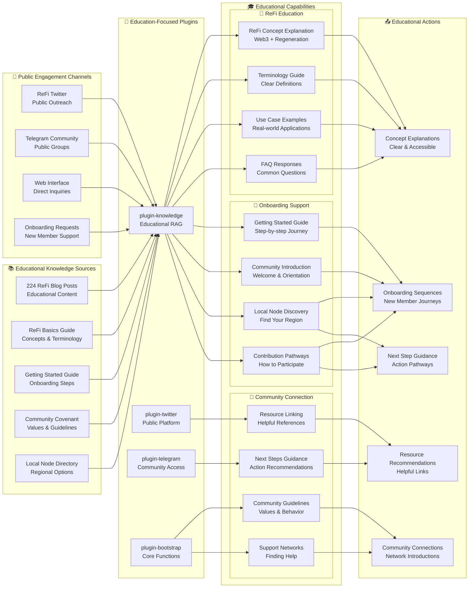
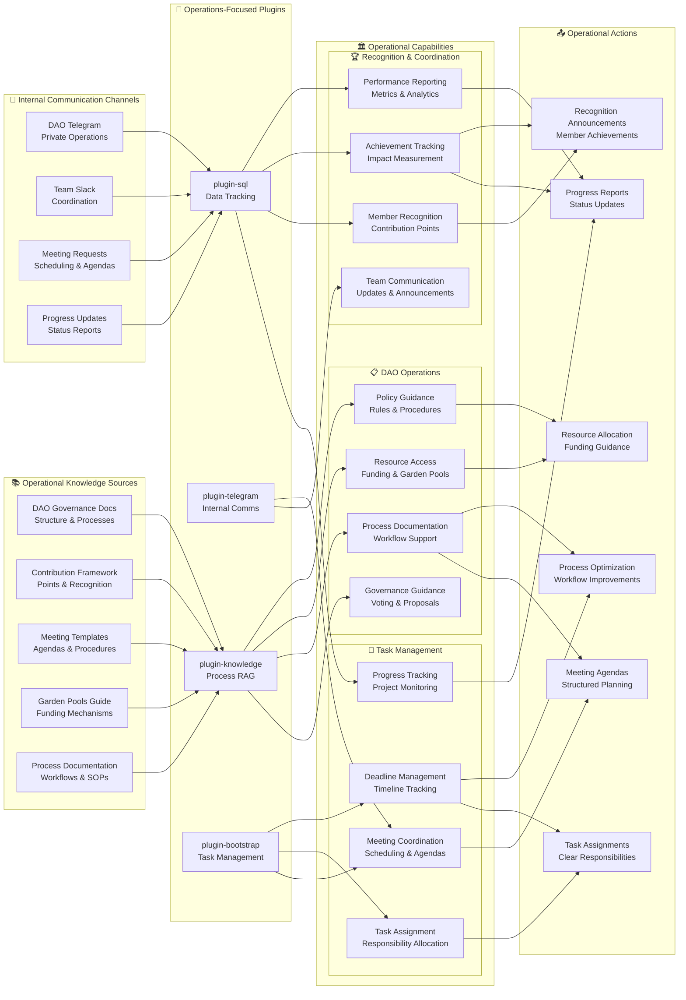
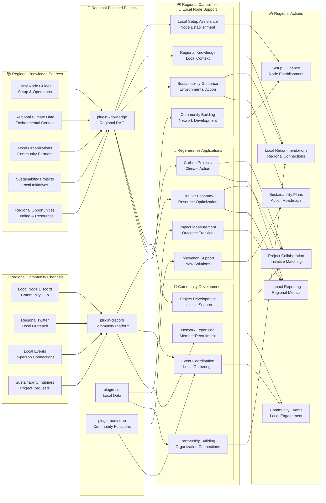
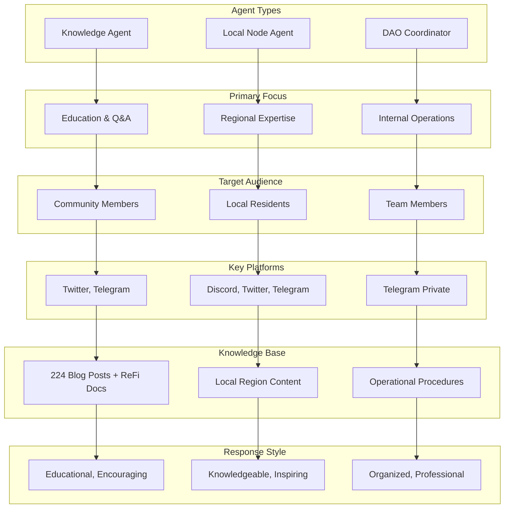
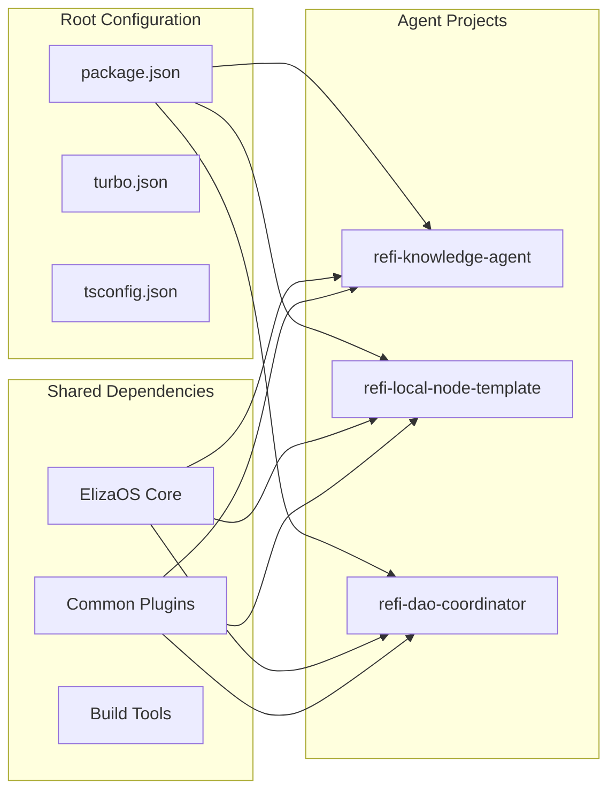

# ReFi Agent Ecosystem

A comprehensive framework for ReFi (Regenerative Finance) AI agents built on ElizaOS, designed to support the regenerative finance ecosystem through specialized AI assistants.

## 🌱 Project Overview

This repository contains a collection of specialized AI agents focused on regenerative finance, sustainability, and community coordination. Each agent is designed to serve specific roles within the ReFi ecosystem, from education and community building to operational coordination.


## 🤖 ReFi Agent Template - Complete Plugin & Capability Overview



## 🌱 Agent-Specific Practical Capabilities

### 1. ReF[AI] DAO Community Agent - External Education & Onboarding



### 2. ReF[AI] DAO Global Agent - Internal Operations & Coordination



### 3. ReF[AI] Local Node Agent - Regional Expertise & Community Building



### Agent-Specific Practical Overview

The three specialized diagrams above focus on **real-world capabilities** tailored to each agent's specific role and operational context:

#### **🎯 Agent-Specific Focus Areas**

Each agent is specialized for distinct operational contexts and user needs:

### **1. 🎓 ReF[AI] DAO Community Agent - External Education & Onboarding**

**Primary Focus**: Public-facing education and community onboarding  
**Target Audience**: Newcomers, potential members, public community  
**Key Platforms**: Twitter, public Telegram groups, web interface  

**Specialized Capabilities**:
- **Educational Content**: Clear ReFi concept explanations and terminology guides
- **Onboarding Support**: Step-by-step getting started journeys for new members
- **Community Connection**: Local node discovery and contribution pathway guidance
- **Resource Linking**: Helpful references and next step recommendations

**Unique Knowledge Sources**:
- 224 ReFi blog posts for comprehensive educational content
- ReFi basics guides for clear concept explanation
- Community covenant for values alignment
- Local node directory for regional connections

### **2. 🏛️ ReF[AI] DAO Global Agent - Internal Operations & Coordination**

**Primary Focus**: Internal DAO operations and team coordination  
**Target Audience**: DAO team members, contributors, internal stakeholders  
**Key Platforms**: Private Telegram, team Slack, internal systems  

**Specialized Capabilities**:
- **DAO Operations**: Governance guidance, voting support, policy assistance
- **Task Management**: Meeting coordination, progress tracking, deadline management
- **Recognition Systems**: Contribution points, achievement tracking, performance reporting
- **Resource Management**: Garden pools access, funding allocation, process optimization

**Unique Knowledge Sources**:
- DAO governance documentation for decision-making processes
- Contribution framework for member recognition
- Meeting templates and procedural workflows
- Garden pools guide for funding mechanisms

### **3. 🌍 ReF[AI] Local Node Agent - Regional Expertise & Community Building**

**Primary Focus**: Regional sustainability and local community development  
**Target Audience**: Local residents, sustainability professionals, regional organizations  
**Key Platforms**: Discord community hubs, regional Twitter, local events  

**Specialized Capabilities**:
- **Local Node Support**: Setup assistance, community building, regional context
- **Community Development**: Partnership building, event coordination, network expansion
- **Regenerative Applications**: Carbon projects, circular economy, impact measurement
- **Regional Integration**: Local organization connections, sustainability project development

**Unique Knowledge Sources**:
- Local node guides for community establishment
- Regional climate data and environmental context
- Local organization directories and partnership opportunities
- Sustainability project databases and funding resources

#### **🔧 Shared Technical Foundation**

All agents share core ElizaOS plugins but optimize for their specific use cases:
- **Common**: SQL database, knowledge RAG, bootstrap functions
- **Community Agent**: Enhanced Twitter/Telegram for public engagement
- **Global Agent**: Advanced SQL for data tracking and Telegram for internal comms
- **Local Node Agent**: Discord optimization and regional data management

### Template Agent Overview

This comprehensive template shows **all available plugins and capabilities** that can be configured for any ReFi agent:

#### **🔧 Available Plugins (6 Total)**
- **Core Infrastructure**: SQL Database, Bootstrap Core Functions
- **Knowledge**: Knowledge RAG
- **Platform Integrations**: Discord, Twitter, Telegram

#### **⚡ Available Capabilities (19 Total)**
- **Data Management**: Database Storage, Querying, Vector Storage
- **Knowledge Processing**: RAG Engine, Document Processing, Vector Search, Knowledge Base
- **Platform Integration**: Multi-Platform, Platform-Specific, Real-Time, Asynchronous
- **Operational**: Task Management, Meeting Coordination, Progress Tracking, Team Communication
- **Community & Local**: Local Knowledge, Community Integration, Regional Context, ReFi Applications

#### **📚 Knowledge Sources (5 Types)**
- ReFi Blog Posts (224 articles), ReFi Basics, DAO Structure, Local Knowledge, Operational Procedures

#### **🔌 Input Channels (4 Types)**
- Twitter API, Telegram Bot, Discord Server, API Requests

#### **📤 Output Actions (5 Types)**
- Educational Responses, Operational Tasks, Community Connections, Resource Links, Meeting Agendas

This template serves as the foundation for creating specialized agents by selecting the appropriate plugins and capabilities for each specific use case.

## 📂 Repository Structure

```
refi-agent-ecosystem/
├── README.md                           # This file - project overview and setup
├── package.json                        # Root workspace configuration
├── turbo.json                          # Monorepo build configuration
├── tsconfig.json                       # TypeScript configuration
├── bunfig.toml                         # Bun package manager configuration
│
├── refi-knowledge-agent/               # 🎓 External Q&A and Education Agent
│   ├── src/
│   ├── knowledge/                     # 📚 Knowledge base for ReFi education
│   ├── README.md                      # Agent-specific documentation
│   └── package.json                   # Agent dependencies
│
├── refi-local-node-template/           # 🏛️ Local Node Template Agent
│   ├── src/
│   ├── knowledge/                     # 📍 Local region-specific knowledge
│   ├── README.md                      # Agent-specific documentation
│   └── package.json                   # Agent dependencies
│
├── refi-dao-coordinator/               # 🤝 Internal Operations Coordinator Agent
│   ├── src/
│   ├── knowledge/                     # 📋 Operational knowledge base
│   ├── README.md                      # Agent-specific documentation
│   └── package.json                   # Agent dependencies
```

## 🤖 Agent Specifications

### 1. ReF[AI] DAO Community Agent (External-Facing)
**Location**: `refi-knowledge-agent/`
**Purpose**: Educational Q&A assistant for ReFi concepts and community onboarding

**Character Definition**: `refi-knowledge-agent/src/refiKnowledgeAgent.ts`

```mermaid
graph LR
    subgraph "🔌 Input Channels"
        I1[Twitter API]
        I2[Telegram Bot]
        I3[Direct Web Interface]
    end
    
    subgraph "🧠 Core Agent"
        A1[ReF[AI] DAO Community Agent]
        A2[Character: Educational Guide]
        A3[Response Mode: Educational]
    end
    
    subgraph "🔧 Plugins"
        P1[SQL Database]
        P2[Knowledge RAG]
        P3[LLM Providers]
        P4[Platform Connectors]
        P5[Bootstrap Core]
    end
    
    subgraph "⚡ Capabilities"
        C1[Database Storage]
        C2[Document Processing]
        C3[AI Generation]
        C4[Multi-Platform]
        C5[Core Functions]
    end
    
    subgraph "📚 Knowledge Sources"
        K1[224 Blog Posts]
        K2[ReFi Basics]
        K3[DAO Structure]
        K4[Local Nodes]
        K5[Getting Started]
    end
    
    subgraph "📤 Output & Actions"
        O1[Educational Responses]
        O2[Resource Links]
        O3[Community Connections]
        O4[Next Steps Guide]
    end
    
    subgraph "💾 Data Storage"
        D1[Conversation History]
        D2[User Interactions]
        D3[Knowledge Embeddings]
        D4[Response Templates]
    end
    
    I1 --> A1
    I2 --> A1
    I3 --> A1
    
    A1 --> P1
    A1 --> P2
    A1 --> P3
    A1 --> P4
    A1 --> P5
    
    P1 --> C1
    P2 --> C2
    P3 --> C3
    P4 --> C4
    P5 --> C5
    
    P2 --> K1
    P2 --> K2
    P2 --> K3
    P2 --> K4
    P2 --> K5
    
    C1 --> O1
    C2 --> O1
    C3 --> O1
    C4 --> O1
    C5 --> O1
    
    C1 --> O2
    C2 --> O3
    C3 --> O4
    
    P1 --> D1
    P1 --> D2
    P1 --> D3
    P1 --> D4
```

**Core Capabilities**:
- **Knowledge Base**: Comprehensive ReFi education content and DAO documentation
- **Target Audience**: Newcomers and community members seeking ReFi education
- **Primary Platforms**: Twitter, Telegram (public channels)
- **Response Style**: Educational, encouraging, accessible to beginners

**Key Features**:
- Answers common questions about ReFi concepts and terminology
- Guides users through getting started with ReFi DAO participation
- Explains Local Nodes and community engagement opportunities
- Provides clear explanations of complex financial concepts
- Connects users with relevant resources and next steps

**Knowledge Sources**:
- ReFi basics and terminology (`knowledge/refi-basics/`)
- ReFi DAO overview and structure (`knowledge/refi-dao/`)
- Local Nodes introduction and participation (`knowledge/local-nodes/`)
- Community onboarding guides (`knowledge/getting-started/`)
- 224 ReFi DAO blog posts for comprehensive context (`knowledge/ReFi DAO Blog Posts/`)

### 2. ReF[AI] Local Node Agent (Regional Specialist)
**Location**: `refi-local-node-template/`
**Purpose**: Regional expert for a specific local region's green economy and local ReFi initiatives

**Character Definition**: `refi-local-node-template/src/character.ts`

```mermaid
graph LR
    subgraph "🔌 Input Channels"
        I1[Discord Server]
        I2[Twitter Local Feed]
        I3[Telegram Groups]
        I4[Direct Inquiries]
    end
    
    subgraph "🧠 Core Agent"
        A1[ReF[AI] Local Node Agent]
        A2[Character: Regional Expert]
        A3[Focus: Local Context]
    end
    
    subgraph "🔧 Plugins"
        P1[SQL Database]
        P2[Knowledge RAG]
        P3[LLM Providers]
        P4[Multi-Platform]
        P5[Bootstrap Core]
    end
    
    subgraph "⚡ Capabilities"
        C1[Database Storage]
        C2[Local Knowledge]
        C3[Regional Context]
        C4[Community Integration]
        C5[ReFi Applications]
    end
    
    subgraph "📍 Local Knowledge"
        K1[Local Climate Plan]
        K2[Local Organizations]
        K3[Regional Projects]
        K4[Sustainability Hub]
        K5[Community Resources]
    end
    
    subgraph "🌱 ReFi Integration"
        R1[Carbon Markets]
        R2[Tokenization]
        R3[Community Projects]
        R4[Impact Metrics]
    end
    
    subgraph "📤 Output & Actions"
        O1[Localized Responses]
        O2[Community Connections]
        O3[Project Recommendations]
        O4[Action Steps]
    end
    
    subgraph "💾 Data Storage"
        D1[Local Context]
        D2[Community Data]
        D3[Project Database]
        D4[Regional Knowledge]
    end
    
    I1 --> A1
    I2 --> A1
    I3 --> A1
    I4 --> A1
    
    A1 --> P1
    A1 --> P2
    A1 --> P3
    A1 --> P4
    A1 --> P5
    
    P1 --> C1
    P2 --> C2
    P3 --> C3
    P4 --> C4
    P5 --> C5
    
    P2 --> K1
    P2 --> K2
    P2 --> K3
    P2 --> K4
    P2 --> K5
    
    A1 --> R1
    A1 --> R2
    A1 --> R3
    A1 --> R4
    
    C1 --> O1
    C2 --> O1
    C3 --> O1
    C4 --> O1
    C5 --> O1
    
    C1 --> O2
    C2 --> O3
    C3 --> O4
    
    P1 --> D1
    P1 --> D2
    P1 --> D3
    P1 --> D4
```

**Core Capabilities**:
- **Local Expertise**: Specific local region's sustainability landscape and green economy
- **Target Audience**: Local residents, visitors, and sustainability professionals in the region
- **Primary Platforms**: Discord, Twitter, Telegram
- **Response Style**: Knowledgeable, inspiring, action-oriented

**Key Features**:
- Connects ReFi concepts to the specific local region's context
- Provides information about local sustainability initiatives in the region
- Guides users to region-specific climate action groups
- Explains carbon markets and environmental tokenization opportunities
- Bridges traditional and innovative sustainability approaches

**Specialized Knowledge Areas**:
- Local climate plan and carbon neutrality goals
- Local energy cooperatives (Som Energia)
- Mediterranean blue economy initiatives
- Community solar and urban reforestation projects
- Circular economy marketplaces
- Local climate tech and impact investing communities

### 3. ReF[AI] DAO Global Agent (Internal Operations)
**Location**: `refi-dao-coordinator/`
**Purpose**: Internal coordination assistant for ReFi DAO organizational tasks

**Character Definition**: `refi-dao-coordinator/src/refiDaoCoordinator.ts`

```mermaid
graph LR
    subgraph "🔌 Input Channels"
        I1[Telegram Private]
        I2[Team Requests]
        I3[Meeting Coordination]
        I4[Progress Updates]
    end
    
    subgraph "🧠 Core Agent"
        A1[ReF[AI] DAO Global Agent]
        A2[Character: Internal Assistant]
        A3[Focus: Operations]
    end
    
    subgraph "🔧 Plugins"
        P1[SQL Database]
        P2[LLM Providers]
        P3[Telegram Integration]
        P4[Bootstrap Core]
    end
    
    subgraph "⚡ Capabilities"
        C1[Database Storage]
        C2[Task Management]
        C3[Meeting Coordination]
        C4[Progress Tracking]
        C5[Team Communication]
    end
    
    subgraph "📋 Operational Areas"
        O1[Meeting Coordination]
        O2[Progress Tracking]
        O3[Contributor Recognition]
        O4[Documentation]
    end
    
    subgraph "🏗️ Coordination Engine"
        CE1[Agenda Builder]
        CE2[Progress Tracker]
        CE3[Recognition System]
        CE4[Documentation Manager]
    end
    
    subgraph "📤 Output & Actions"
        O1[Structured Responses]
        O2[Meeting Agendas]
        O3[Progress Reports]
        O4[Action Items]
        O5[Recognition Announcements]
    end
    
    subgraph "💾 Data Storage"
        D1[Meeting Records]
        D2[Project Tracking]
        D3[Contributor Profiles]
        D4[Process Templates]
        D5[Progress Metrics]
    end
    
    I1 --> A1
    I2 --> A1
    I3 --> A1
    I4 --> A1
    
    A1 --> P1
    A1 --> P2
    A1 --> P3
    A1 --> P4
    
    A1 --> O1
    A1 --> O2
    A1 --> O3
    A1 --> O4
    
    A1 --> CE1
    A1 --> CE2
    A1 --> CE3
    A1 --> CE4
    
    P1 --> C1
    P2 --> C2
    P3 --> C3
    P4 --> C4
    
    C1 --> O1
    C2 --> O1
    C3 --> O1
    C4 --> O1
    C5 --> O1
    
    C1 --> O2
    C2 --> O3
    C3 --> O4
    C4 --> O5
    
    P1 --> D1
    P1 --> D2
    P1 --> D3
    P1 --> D4
    P1 --> D5
```

**Core Capabilities**:
- **Internal Focus**: DAO operations, team coordination, and process management
- **Target Audience**: ReFi DAO team members and contributors
- **Primary Platforms**: Telegram (private channels), Discord (internal)
- **Response Style**: Organized, professional, efficient

**Key Features**:
- Meeting agenda creation and coordination
- Progress tracking for grants and projects
- Contributor recognition and achievement tracking
- Task management and workflow optimization
- Documentation organization and maintenance
- Financial reporting assistance
- Team collaboration facilitation

**Operational Areas**:
- Meeting coordination and agenda management (`knowledge/operations/`)
- Contributor recognition systems (`knowledge/coordination/`)
- Process templates and workflows (`knowledge/processes/`)
- Task and project progress monitoring
- Internal communication optimization
- Documentation and process improvement
- Team workflow coordination

## 📊 Agent Template Diagrams

### 1. ReF[AI] DAO Community Agent - Complete System Overview

```mermaid
graph LR
    subgraph "🔌 Input Channels"
        I1[Twitter API]
        I2[Telegram Bot]
        I3[Direct Web Interface]
    end
    
    subgraph "🧠 Core Agent"
        A1[ReF[AI] DAO Community Agent]
        A2[Character: Educational Guide]
        A3[Response Mode: Educational]
    end
    
    subgraph "🔧 Plugins"
        P1[SQL Database]
        P2[Knowledge RAG]
        P3[LLM Providers]
        P4[Platform Connectors]
        P5[Bootstrap Core]
    end
    
    subgraph "⚡ Capabilities"
        C1[Database Storage]
        C2[Document Processing]
        C3[AI Generation]
        C4[Multi-Platform]
        C5[Core Functions]
    end
    
    subgraph "📚 Knowledge Sources"
        K1[224 Blog Posts]
        K2[ReFi Basics]
        K3[DAO Structure]
        K4[Local Nodes]
        K5[Getting Started]
    end
    
    subgraph "📤 Output & Actions"
        O1[Educational Responses]
        O2[Resource Links]
        O3[Community Connections]
        O4[Next Steps Guide]
    end
    
    subgraph "💾 Data Storage"
        D1[Conversation History]
        D2[User Interactions]
        D3[Knowledge Embeddings]
        D4[Response Templates]
    end
    
    I1 --> A1
    I2 --> A1
    I3 --> A1
    
    A1 --> P1
    A1 --> P2
    A1 --> P3
    A1 --> P4
    A1 --> P5
    
    P1 --> C1
    P2 --> C2
    P3 --> C3
    P4 --> C4
    P5 --> C5
    
    P2 --> K1
    P2 --> K2
    P2 --> K3
    P2 --> K4
    P2 --> K5
    
    C1 --> O1
    C2 --> O1
    C3 --> O1
    C4 --> O1
    C5 --> O1
    
    C1 --> O2
    C2 --> O3
    C3 --> O4
    
    P1 --> D1
    P1 --> D2
    P1 --> D3
    P1 --> D4
```

### 2. ReF[AI] Local Node Agent - Complete System Overview

```mermaid
graph LR
    subgraph "🔌 Input Channels"
        I1[Discord Server]
        I2[Twitter Local Feed]
        I3[Telegram Groups]
        I4[Direct Inquiries]
    end
    
    subgraph "🧠 Core Agent"
        A1[ReF[AI] Local Node Agent]
        A2[Character: Regional Expert]
        A3[Focus: Local Context]
    end
    
    subgraph "🔧 Plugins"
        P1[SQL Database]
        P2[Knowledge RAG]
        P3[LLM Providers]
        P4[Multi-Platform]
        P5[Bootstrap Core]
    end
    
    subgraph "⚡ Capabilities"
        C1[Database Storage]
        C2[Document Processing]
        C3[AI Generation]
        C4[Multi-Platform]
        C5[Core Functions]
    end
    
    subgraph "📍 Local Knowledge"
        K1[Local Climate Plan]
        K2[Local Organizations]
        K3[Regional Projects]
        K4[Sustainability Hub]
        K5[Community Resources]
    end
    
    subgraph "🌱 ReFi Integration"
        R1[Carbon Markets]
        R2[Tokenization]
        R3[Community Projects]
        R4[Impact Metrics]
    end
    
    subgraph "📤 Output & Actions"
        O1[Localized Responses]
        O2[Community Connections]
        O3[Project Recommendations]
        O4[Action Steps]
    end
    
    subgraph "💾 Data Storage"
        D1[Local Context]
        D2[Community Data]
        D3[Project Database]
        D4[Regional Knowledge]
    end
    
    I1 --> A1
    I2 --> A1
    I3 --> A1
    I4 --> A1
    
    A1 --> P1
    A1 --> P2
    A1 --> P3
    A1 --> P4
    A1 --> P5
    
    P1 --> C1
    P2 --> C2
    P3 --> C3
    P4 --> C4
    P5 --> C5
    
    P2 --> K1
    P2 --> K2
    P2 --> K3
    P2 --> K4
    P2 --> K5
    
    A1 --> R1
    A1 --> R2
    A1 --> R3
    A1 --> R4
    

    
    A1 --> O1
    A1 --> O2
    A1 --> O3
    A1 --> O4
    
    P1 --> D1
    P1 --> D2
    P1 --> D3
    P1 --> D4
```

### 3. ReF[AI] DAO Global Agent - Complete System Overview

```mermaid
graph LR
    subgraph "🔌 Input Channels"
        I1[Telegram Private]
        I2[Team Requests]
        I3[Meeting Coordination]
        I4[Progress Updates]
    end
    
    subgraph "🧠 Core Agent"
        A1[ReF[AI] DAO Global Agent]
        A2[Character: Internal Assistant]
        A3[Focus: Operations]
    end
    
    subgraph "🔧 Plugins"
        P1[SQL Database]
        P2[LLM Providers]
        P3[Telegram Integration]
        P4[Bootstrap Core]
    end
    
    subgraph "⚡ Capabilities"
        C1[Database Storage]
        C2[Document Processing]
        C3[AI Generation]
        C4[Multi-Platform]
        C5[Core Functions]
    end
    
    subgraph "📋 Operational Areas"
        O1[Meeting Coordination]
        O2[Progress Tracking]
        O3[Contributor Recognition]
        O4[Documentation]
    end
    
    subgraph "🏗️ Coordination Engine"
        CE1[Agenda Builder]
        CE2[Progress Tracker]
        CE3[Recognition System]
        CE4[Documentation Manager]
    end
    
    subgraph "📤 Output & Actions"
        O1[Structured Responses]
        O2[Meeting Agendas]
        O3[Progress Reports]
        O4[Action Items]
        O5[Recognition Announcements]
    end
    
    subgraph "💾 Data Storage"
        D1[Meeting Records]
        D2[Project Tracking]
        D3[Contributor Profiles]
        D4[Process Templates]
        D5[Progress Metrics]
    end
    
    I1 --> A1
    I2 --> A1
    I3 --> A1
    I4 --> A1
    
    A1 --> P1
    A1 --> P2
    A1 --> P3
    A1 --> P4
    
    A1 --> O1
    A1 --> O2
    A1 --> O3
    A1 --> O4
    
    A1 --> CE1
    A1 --> CE2
    A1 --> CE3
    A1 --> CE4
    
    P1 --> C1
    P2 --> C2
    P3 --> C3
    P4 --> C4
    
    C1 --> O1
    C2 --> O1
    C3 --> O1
    C4 --> O1
    C5 --> O1
    
    C1 --> O2
    C2 --> O3
    C3 --> O4
    C4 --> O5
    
    P1 --> D1
    P1 --> D2
    P1 --> D3
    P1 --> D4
    P1 --> D5
```

### 4. Cross-Agent Comparison Matrix



## 🏗️ Architecture

### Core Components

```mermaid
graph TB
    subgraph "ElizaOS Architecture"
        subgraph "Agent Layer"
            A1[ReF[AI] DAO Community Agent]
            A2[ReF[AI] Local Node Agent]  
            A3[ReF[AI] DAO Global Agent]
        end
        
        subgraph "Plugin System"
            P1[SQL Plugin]
            P2[Knowledge Plugin]
            P3[Platform Plugins]
            P4[Bootstrap Plugin]
        end
        
        subgraph "Platform Connectors"
            PC1[Discord Connector]
            PC2[Twitter Connector]
            PC3[Telegram Connector]
        end
        
        subgraph "Core Runtime"
            CR1[AgentRuntime]
            CR2[Memory System]
            CR3[LLM Integration]
        end
        
        subgraph "Knowledge Base"
            KB1[RAG Processing]
            KB2[Document Store]
            KB3[Vector Search]
        end
    end
    
    A1 --> P1
    A1 --> P2
    A2 --> P1
    A2 --> P2
    A3 --> P1
    
    P3 --> PC1
    P3 --> PC2
    P3 --> PC3
    
    A1 --> CR1
    A2 --> CR1
    A3 --> CR1
    
    CR1 --> CR2
    CR1 --> CR3
    
    P2 --> KB1
    KB1 --> KB2
    KB1 --> KB3
```

Each agent is built using ElizaOS core components:

- **Character Definition**: Personality, knowledge, and behavior configuration
- **Plugin System**: Modular capabilities (SQL, knowledge, platform integrations)
- **Knowledge Base**: RAG-enabled document processing for specialized knowledge
- **Platform Connectors**: Discord, Twitter, Telegram integrations
- **Runtime Environment**: ElizaOS agent runtime with full feature support

### Plugin Configuration

All agents use a common plugin stack with conditional loading based on environment variables:

```typescript
plugins: [
  '@elizaos/plugin-sql',           // Database integration
  '@elizaos/plugin-knowledge',     // RAG knowledge processing (where applicable)
  
  // LLM Providers (conditional based on API keys)
  '@elizaos/plugin-openai',        // OpenAI model integration
  '@elizaos/plugin-anthropic',     // Anthropic model integration
  '@elizaos/plugin-openrouter',    // OpenRouter integration
  '@elizaos/plugin-google-genai',  // Google Generative AI
  '@elizaos/plugin-ollama',        // Local Ollama models
  
  // Platform Integrations (conditional based on tokens)
  '@elizaos/plugin-discord',       // Discord platform integration
  '@elizaos/plugin-twitter',       // Twitter platform integration
  '@elizaos/plugin-telegram',      // Telegram platform integration
  
  '@elizaos/plugin-bootstrap',     // Core functionality
]
```

### Monorepo Structure



This project uses a monorepo structure with:
- **Root Configuration**: Shared TypeScript, Bun, and Turbo configurations
- **Individual Agents**: Self-contained projects with their own dependencies
- **Shared Dependencies**: Core ElizaOS packages shared across all agents
- **Build System**: Turbo for efficient building and development

## 🚀 Getting Started

### Prerequisites

- **Node.js 18+** or **Bun** (recommended)
- **Git** for version control
- **API Keys** for your chosen LLM providers and platforms

### Installation

1. **Clone the repository**:
   ```bash
   git clone https://github.com/ReFiDAO/regen_eliza-refi_dao.git
   cd regen_eliza-refi_dao
   ```

2. **Install dependencies**:
   ```bash
   bun install
   ```

3. **Configure environment variables**:
   Create `.env` files in each agent directory with your API keys:
   ```bash
   # LLM Providers (choose one or more)
   OPENAI_API_KEY=your_openai_key
   ANTHROPIC_API_KEY=your_anthropic_key
   OPENROUTER_API_KEY=your_openrouter_key
   GOOGLE_GENERATIVE_AI_API_KEY=your_google_key
   OLLAMA_API_ENDPOINT=http://localhost:11434
   
   # Platform Integrations (choose based on your needs)
   DISCORD_API_TOKEN=your_discord_token
   TWITTER_API_KEY=your_twitter_key
   TWITTER_API_SECRET_KEY=your_twitter_secret
   TWITTER_ACCESS_TOKEN=your_twitter_access_token
   TWITTER_ACCESS_TOKEN_SECRET=your_twitter_access_secret
   TELEGRAM_BOT_TOKEN=your_telegram_token
   ```

### Running Individual Agents

Each agent can be run independently:

```bash
# ReF[AI] DAO Community Agent
cd refi-knowledge-agent
bun run start

# ReF[AI] Local Node Agent
cd refi-local-node-template
bun run start

# ReF[AI] DAO Global Agent
cd refi-dao-coordinator
bun run start
```

### Development

```bash
# Run tests for all agents
bun run test

# Run tests for specific agent
cd refi-knowledge-agent
bun run test

# Development mode with hot reload
bun run dev
```

## 🔄 Comprehensive UML Flow Diagram

### Complete ReFi Agent Ecosystem Architecture

```mermaid
graph TB
    %% External Input Sources
    subgraph "🌐 External Platforms"
        TW[Twitter API]
        TG[Telegram Bot]
        DC[Discord Server]
        WB[Web Interface]
        US[User Requests]
    end
    
    %% Core Agent Layer
    subgraph "🤖 Agent Layer"
        KA[ReF[AI] DAO Community Agent]
        LA[Local Node Agent]
        DA[DAO Coordinator Agent]
    end
    
    %% ElizaOS Runtime
    subgraph "⚙️ ElizaOS Runtime"
        RT[AgentRuntime]
        MM[Memory System]
        EV[Event Handler]
        PL[Plugin Manager]
    end
    
    %% Plugin System
    subgraph "🔧 Plugin System"
        SQL[plugin-sql]
        KNW[plugin-knowledge]
        OAI[plugin-openai]
        ANT[plugin-anthropic]
        ORT[plugin-openrouter]
        GAI[plugin-google-genai]
        OLM[plugin-ollama]
        DSC[plugin-discord]
        TWT[plugin-twitter]
        TEL[plugin-telegram]
        BST[plugin-bootstrap]
    end
    
    %% Knowledge Base
    subgraph "📚 Knowledge Base"
        KB1[ReFi Blog Posts<br/>224 Articles]
        KB2[ReFi Basics<br/>Terminology]
        KB3[DAO Structure<br/>Organization]
        KB4[Local Knowledge<br/>Regional Data]
        KB5[Operational<br/>Procedures]
    end
    
    %% Data Storage
    subgraph "💾 Data Storage"
        DB1[Conversation History]
        DB2[User Interactions]
        DB3[Knowledge Embeddings]
        DB4[Project Tracking]
        DB5[Meeting Records]
        DB6[Contributor Profiles]
    end
    
    %% Processing Layer
    subgraph "🧠 Processing Layer"
        RAG[RAG Engine<br/>Retrieval-Augmented Generation]
        LLM[LLM Integration<br/>Large Language Models]
        NLP[Natural Language<br/>Processing]
        VEC[Vector Search<br/>Similarity Matching]
    end
    
    %% Output Actions
    subgraph "📤 Output Actions"
        OA1[Educational Responses]
        OA2[Localized Guidance]
        OA3[Operational Tasks]
        OA4[Community Connections]
        OA5[Resource Links]
        OA6[Meeting Agendas]
        OA7[Progress Reports]
    end
    
    %% External Outputs
    subgraph "🌍 External Outputs"
        TW_OUT[Twitter Posts]
        TG_OUT[Telegram Messages]
        DC_OUT[Discord Messages]
        WB_OUT[Web Responses]
        API_OUT[API Responses]
    end
    
    %% Data Flow Connections
    %% External Inputs to Agents
    TW --> KA
    TG --> KA
    WB --> KA
    US --> KA
    
    DC --> LA
    TW --> LA
    TG --> LA
    US --> LA
    
    TG --> DA
    US --> DA
    
    %% Agents to Runtime
    KA --> RT
    LA --> RT
    DA --> RT
    
    %% Runtime to Components
    RT --> MM
    RT --> EV
    RT --> PL
    
    %% Plugin Manager to Plugins
    PL --> SQL
    PL --> KNW
    PL --> OAI
    PL --> ANT
    PL --> ORT
    PL --> GAI
    PL --> OLM
    PL --> DSC
    PL --> TWT
    PL --> TEL
    PL --> BST
    
    %% Knowledge Plugin to Knowledge Base
    KNW --> RAG
    RAG --> KB1
    RAG --> KB2
    RAG --> KB3
    RAG --> KB4
    RAG --> KB5
    
    %% LLM Plugins to Processing
    OAI --> LLM
    ANT --> LLM
    ORT --> LLM
    GAI --> LLM
    OLM --> LLM
    
    %% Processing Layer Connections
    LLM --> NLP
    RAG --> VEC
    VEC --> NLP
    
    %% Database Connections
    SQL --> DB1
    SQL --> DB2
    SQL --> DB3
    SQL --> DB4
    SQL --> DB5
    SQL --> DB6
    
    %% Processing to Outputs
    NLP --> OA1
    NLP --> OA2
    NLP --> OA3
    NLP --> OA4
    NLP --> OA5
    NLP --> OA6
    NLP --> OA7
    
    %% Outputs to External Platforms
    OA1 --> TW_OUT
    OA1 --> TG_OUT
    OA1 --> WB_OUT
    
    OA2 --> DC_OUT
    OA2 --> TG_OUT
    OA2 --> WB_OUT
    
    OA3 --> TG_OUT
    OA3 --> API_OUT
    
    OA4 --> TW_OUT
    OA4 --> TG_OUT
    OA4 --> DC_OUT
    
    OA5 --> WB_OUT
    OA5 --> TG_OUT
    
    OA6 --> TG_OUT
    OA6 --> API_OUT
    
    OA7 --> TG_OUT
    OA7 --> API_OUT
    
    %% Platform Plugins to External Outputs
    TWT --> TW_OUT
    TEL --> TG_OUT
    DSC --> DC_OUT
    
    %% Memory System Feedback
    MM --> DB1
    MM --> DB2
    MM --> DB3
    
    %% Event Handler to Processing
    EV --> RAG
    EV --> LLM
    
    %% Styling
    classDef agentClass fill:#e1f5fe,stroke:#01579b,stroke-width:2px
    classDef runtimeClass fill:#f3e5f5,stroke:#4a148c,stroke-width:2px
    classDef pluginClass fill:#e8f5e8,stroke:#1b5e20,stroke-width:2px
    classDef knowledgeClass fill:#fff3e0,stroke:#e65100,stroke-width:2px
    classDef storageClass fill:#fce4ec,stroke:#880e4f,stroke-width:2px
    classDef processingClass fill:#f1f8e9,stroke:#33691e,stroke-width:2px
    classDef outputClass fill:#e0f2f1,stroke:#004d40,stroke-width:2px
    classDef externalClass fill:#fafafa,stroke:#424242,stroke-width:1px
    
    class KA,LA,DA agentClass
    class RT,MM,EV,PL runtimeClass
    class SQL,KNW,OAI,ANT,ORT,GAI,OLM,DSC,TWT,TEL,BST pluginClass
    class KB1,KB2,KB3,KB4,KB5 knowledgeClass
    class DB1,DB2,DB3,DB4,DB5,DB6 storageClass
    class RAG,LLM,NLP,VEC processingClass
    class OA1,OA2,OA3,OA4,OA5,OA6,OA7 outputClass
    class TW,TG,DC,WB,US,TW_OUT,TG_OUT,DC_OUT,WB_OUT,API_OUT externalClass
```

### System Flow Description

#### **1. Input Layer (🌐 External Platforms)**
- **Twitter API**: Public engagement and community outreach
- **Telegram Bot**: Direct messaging and group interactions
- **Discord Server**: Community discussions and local node coordination
- **Web Interface**: Direct user interactions and API access
- **User Requests**: Internal team requests and coordination tasks

#### **2. Agent Layer (🤖 Agent Layer)**
- **ReF[AI] DAO Community Agent**: Educational Q&A and community onboarding
- **Local Node Template Agent**: Regional expertise and local sustainability
- **DAO Coordinator Agent**: Internal operations and team coordination

#### **3. Runtime Layer (⚙️ ElizaOS Runtime)**
- **AgentRuntime**: Core execution engine and state management
- **Memory System**: Persistent storage and context management
- **Event Handler**: Asynchronous event processing and routing
- **Plugin Manager**: Dynamic plugin loading and lifecycle management

#### **4. Plugin System (🔧 Plugin System)**
- **Core Plugins**: SQL database, knowledge RAG, bootstrap functionality
- **LLM Providers**: OpenAI, Anthropic, OpenRouter, Google, Ollama
- **Platform Connectors**: Discord, Twitter, Telegram integrations

#### **5. Knowledge Base (📚 Knowledge Base)**
- **ReFi Content**: 224 blog posts, terminology, DAO structure
- **Local Knowledge**: Regional data, sustainability initiatives
- **Operational Data**: Procedures, templates, workflows

#### **6. Processing Layer (🧠 Processing Layer)**
- **RAG Engine**: Retrieval-augmented generation for knowledge queries
- **LLM Integration**: Large language model processing and generation
- **NLP**: Natural language understanding and response generation
- **Vector Search**: Semantic similarity and content retrieval

#### **7. Data Storage (💾 Data Storage)**
- **Conversation History**: User interaction logs and context
- **Knowledge Embeddings**: Vector representations of content
- **Operational Data**: Project tracking, meeting records, contributor profiles

#### **8. Output Actions (📤 Output Actions)**
- **Educational Responses**: Knowledge sharing and guidance
- **Localized Guidance**: Region-specific recommendations
- **Operational Tasks**: Meeting coordination, progress tracking
- **Community Connections**: Resource linking and networking

#### **9. External Outputs (🌍 External Outputs)**
- **Platform Responses**: Messages sent back to external platforms
- **API Responses**: Programmatic access and integrations
- **Web Responses**: Direct user interface interactions

### Key Data Flow Patterns

1. **Input → Agent → Runtime → Processing → Output**: Standard request-response flow
2. **Knowledge Base → RAG → Vector Search → LLM**: Knowledge retrieval and generation
3. **Memory System → Database → Context**: Persistent state management
4. **Event Handler → Plugin Manager → Platform Connectors**: Asynchronous event processing
5. **Processing Layer → Multiple Outputs**: Parallel response generation and routing

This comprehensive UML diagram shows the complete architecture, data flows, and interactions within the ReFi Agent Ecosystem, demonstrating how all components work together to provide specialized AI assistance for regenerative finance initiatives.
