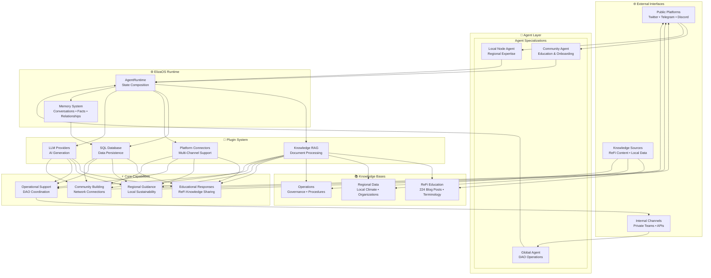

# ReFi Agent Ecosystem

A comprehensive framework for ReFi (Regenerative Finance) AI agents built on ElizaOS, designed to support the regenerative finance ecosystem through specialized AI assistants.

## 🌱 Project Overview

This repository contains a collection of specialized AI agents focused on regenerative finance, sustainability, and community coordination. Each agent is designed to serve specific roles within the ReFi ecosystem, from education and community building to operational coordination.


## 🏗️ ReFi Agent Ecosystem - Master Architecture



## 🌱 Agent Specializations

The master architecture above shows how three specialized agents share the same ElizaOS foundation while focusing on different aspects of the ReFi ecosystem:

### **🎯 Agent Focus Areas**

### **1. 🎓 Community Agent - Education & Onboarding**
- **Target**: Public audiences, newcomers to ReFi
- **Platforms**: Twitter, public Telegram, web interface
- **Focus**: Educational content, onboarding flows, community connections
- **Knowledge**: 224 ReFi blog posts, terminology guides, getting started content

### **2. 🌍 Local Node Agent - Regional Expertise** 
- **Target**: Local communities, sustainability professionals
- **Platforms**: Discord hubs, regional Twitter, local events
- **Focus**: Local context, regional partnerships, sustainability projects
- **Knowledge**: Climate data, local organizations, regional opportunities

### **3. 🏛️ Global Agent - DAO Operations**
- **Target**: Internal team members, contributors
- **Platforms**: Private Telegram, team channels, APIs  
- **Focus**: Governance, task coordination, process management
- **Knowledge**: DAO procedures, meeting templates, contribution frameworks

### **🔧 Shared Foundation**

All agents use the same ElizaOS core with specialized configurations:
- **Common Plugins**: Knowledge RAG, SQL Database, LLM Providers, Bootstrap
- **Platform Connectors**: Discord, Twitter, Telegram (conditionally loaded)
- **Specialized Knowledge**: Agent-specific content optimized for their role

## 📂 Repository Structure

```
refi-agent-ecosystem/
├── README.md                           # This file - project overview and setup
├── package.json                        # Root workspace configuration
├── turbo.json                          # Monorepo build configuration
├── tsconfig.json                       # TypeScript configuration
├── bunfig.toml                         # Bun package manager configuration
│
├── refi-knowledge-agent/               # 🎓 External Q&A and Education Agent
│   ├── src/
│   ├── knowledge/                     # 📚 Knowledge base for ReFi education
│   ├── README.md                      # Agent-specific documentation
│   └── package.json                   # Agent dependencies
│
├── refi-local-node-template/           # 🏛️ Local Node Template Agent
│   ├── src/
│   ├── knowledge/                     # 📍 Local region-specific knowledge
│   ├── README.md                      # Agent-specific documentation
│   └── package.json                   # Agent dependencies
│
├── refi-dao-coordinator/               # 🤝 Internal Operations Coordinator Agent
│   ├── src/
│   ├── knowledge/                     # 📋 Operational knowledge base
│   ├── README.md                      # Agent-specific documentation
│   └── package.json                   # Agent dependencies
```

## 🏗️ Technical Architecture

### Core Components
- **Character Definition**: Personality, knowledge, and behavior configuration
- **Plugin System**: Modular capabilities (SQL, knowledge, platform integrations)  
- **Knowledge Base**: RAG-enabled document processing for specialized knowledge
- **Platform Connectors**: Discord, Twitter, Telegram integrations
- **Runtime Environment**: ElizaOS agent runtime with full feature support

### Plugin Stack
All agents use a common plugin configuration with conditional loading:
- **Core**: `@elizaos/plugin-sql`, `@elizaos/plugin-bootstrap`
- **Knowledge**: `@elizaos/plugin-knowledge` (RAG processing)
- **LLM Providers**: OpenAI, Anthropic, OpenRouter, Google, Ollama (based on API keys)
- **Platforms**: Discord, Twitter, Telegram (based on tokens)

### Monorepo Structure
- **Root Configuration**: Shared TypeScript, Bun, and Turbo configurations
- **Individual Agents**: Self-contained projects with their own dependencies  
- **Shared Dependencies**: Core ElizaOS packages shared across all agents
- **Build System**: Turbo for efficient building and development

## 🚀 Getting Started

### Prerequisites

- **Node.js 18+** or **Bun** (recommended)
- **Git** for version control
- **API Keys** for your chosen LLM providers and platforms

### Installation

1. **Clone the repository**:
   ```bash
   git clone https://github.com/ReFiDAO/regen_eliza-refi_dao.git
   cd regen_eliza-refi_dao
   ```

2. **Install dependencies**:
   ```bash
   bun install
   ```

3. **Configure environment variables**:
   Create `.env` files in each agent directory with your API keys:
   ```bash
   # LLM Providers (choose one or more)
   OPENAI_API_KEY=your_openai_key
   ANTHROPIC_API_KEY=your_anthropic_key
   OPENROUTER_API_KEY=your_openrouter_key
   GOOGLE_GENERATIVE_AI_API_KEY=your_google_key
   OLLAMA_API_ENDPOINT=http://localhost:11434
   
   # Platform Integrations (choose based on your needs)
   DISCORD_API_TOKEN=your_discord_token
   TWITTER_API_KEY=your_twitter_key
   TWITTER_API_SECRET_KEY=your_twitter_secret
   TWITTER_ACCESS_TOKEN=your_twitter_access_token
   TWITTER_ACCESS_TOKEN_SECRET=your_twitter_access_secret
   TELEGRAM_BOT_TOKEN=your_telegram_token
   ```

### Running Individual Agents

Each agent can be run independently:

```bash
# ReF[AI] DAO Community Agent
cd refi-knowledge-agent
bun run start

# ReF[AI] Local Node Agent
cd refi-local-node-template
bun run start

# ReF[AI] DAO Global Agent
cd refi-dao-coordinator
bun run start
```

### Development

```bash
# Run tests for all agents
bun run test

# Run tests for specific agent
cd refi-knowledge-agent
bun run test

# Development mode with hot reload
bun run dev
```

## 🔄 Data Flow Summary

The master architecture shows a clean flow:

1. **Input**: External platforms feed requests to specialized agents
2. **Processing**: ElizaOS runtime coordinates plugins and knowledge processing  
3. **Knowledge**: RAG system retrieves relevant content from specialized knowledge bases
4. **Generation**: LLM providers generate contextual responses
5. **Output**: Responses flow back through platform connectors to users

Each agent shares this same underlying flow while specializing in different knowledge domains and platform optimizations.
