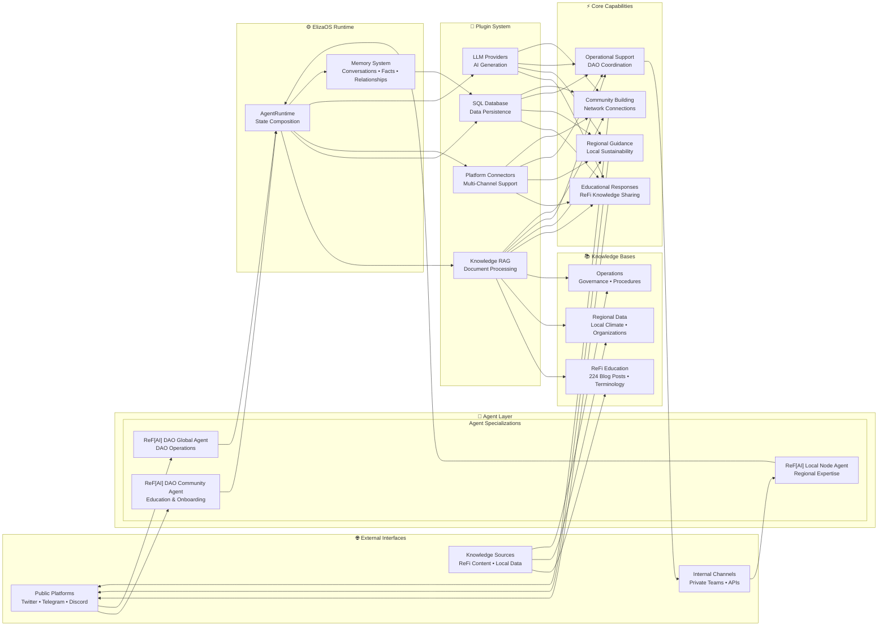
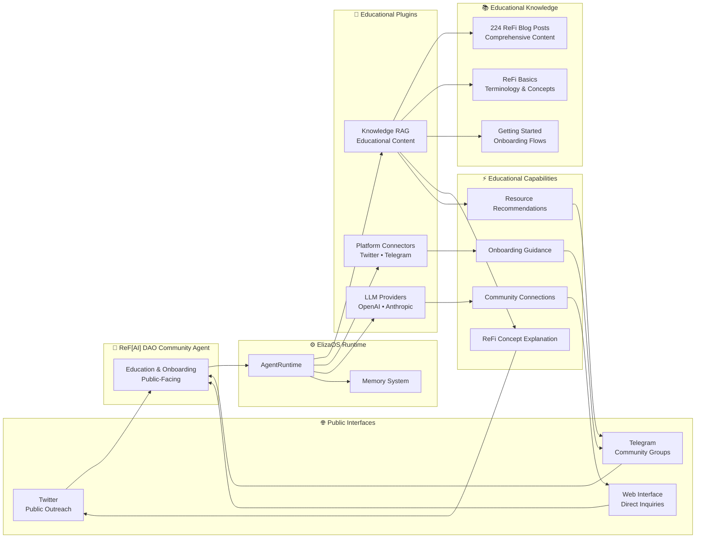
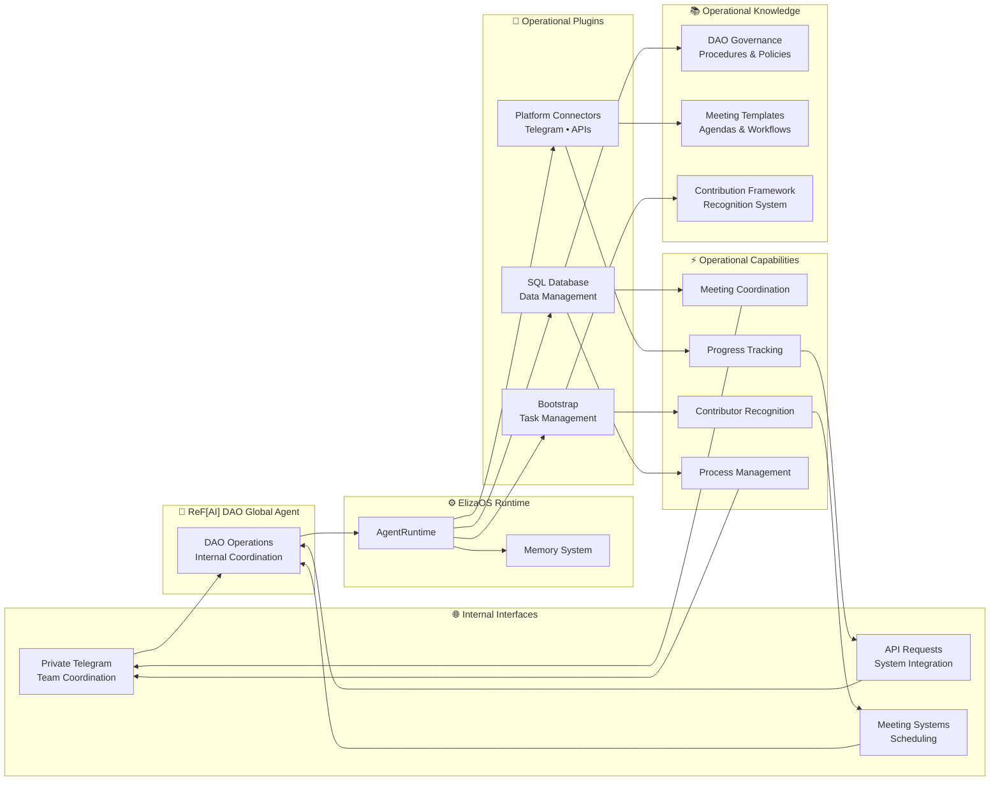
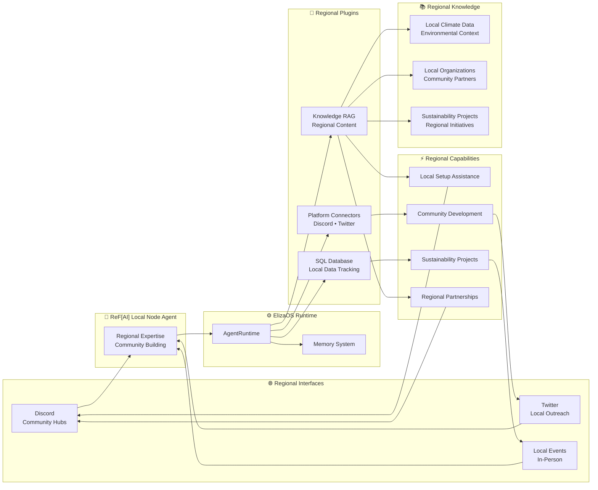

# ReFi Agent Ecosystem

A comprehensive framework for ReFi (Regenerative Finance) AI agents built on ElizaOS, designed to support the regenerative finance ecosystem through specialized AI assistants.

## 🌱 Project Overview

This repository contains a collection of specialized AI agents focused on regenerative finance, sustainability, and community coordination. Each agent is designed to serve specific roles within the ReFi ecosystem, from education and community building to operational coordination.


## 🏗️ ReFi Agent Ecosystem - Master Architecture



## 🌱 Agent-Specific Architectures

### 1. 🌱 ReF[AI] DAO Community Agent

**🔗 Agent Documentation**: [`refi-dao-community-agent/README.md`](refi-dao-community-agent/README.md)



**🎯 Target Audience**: Public, newcomers  
**🌐 Primary Platforms**: Twitter, Telegram  
**⚡ Core Capabilities**: Education, Onboarding  
**📚 Knowledge Focus**: ReFi concepts, Blog posts  
**🔧 Plugin Emphasis**: Knowledge RAG, Social  

### 2. 🌐 ReF[AI] DAO Global Agent

**🔗 Agent Documentation**: [`refi-dao-global-agent/README.md`](refi-dao-global-agent/README.md)



**🎯 Target Audience**: Internal team  
**🌐 Primary Platforms**: Telegram  
**⚡ Core Capabilities**: Operations, Coordination  
**📚 Knowledge Focus**: DAO governance, Processes  
**🔧 Plugin Emphasis**: SQL Database, Task management  

### 3. 🌍 ReF[AI] Local Node Agent

**🔗 Agent Documentation**: [`refi-local-node-agent/README.md`](refi-local-node-agent/README.md)



**🎯 Target Audience**: Local nodes & communities  
**🌐 Primary Platforms**: Telegram, Twitter  
**⚡ Core Capabilities**: Regional expertise  
**📚 Knowledge Focus**: Local data, Climate info  
**🔧 Plugin Emphasis**: Knowledge RAG, Data tracking

## 🔄 Agent Comparison

| Aspect | 🌱 ReF[AI] DAO Community Agent | 🌐 ReF[AI] DAO Global Agent | 🌍 ReF[AI] Local Node Agent |
|--------|------------------------------|------------------------------|------------------------------|
| **🎯 Target Audience** | Public, newcomers | Internal team | Local nodes & communities |
| **🌐 Primary Platforms** | Twitter, Telegram | Telegram | Telegram, Twitter |
| **⚡ Core Capabilities** | Education, Onboarding | Operations, Coordination | Regional expertise |
| **📚 Knowledge Focus** | ReFi concepts, Blog posts | DAO governance, Processes | Local data, Climate info |
| **🔧 Plugin Emphasis** | Knowledge RAG, Social | SQL Database, Task management | Knowledge RAG, Data tracking |

### 🔧 Shared Foundation

All three agents share the same ElizaOS architecture with specialized configurations:
- **Common Runtime**: AgentRuntime, Memory System, Plugin Manager
- **Core Plugins**: Knowledge RAG, SQL Database, LLM Providers, Bootstrap  
- **Platform Connectors**: Discord, Twitter, Telegram (conditionally loaded)
- **Specialized Content**: Agent-specific knowledge bases and capabilities

### 🔄 Data Flow Summary

The master architecture shows a clean flow:

1. **Input**: External platforms feed requests to specialized agents
2. **Processing**: ElizaOS runtime coordinates plugins and knowledge processing  
3. **Knowledge**: RAG system retrieves relevant content from specialized knowledge bases
4. **Generation**: LLM providers generate contextual responses
5. **Output**: Responses flow back through platform connectors to users

Each agent shares this same underlying flow while specializing in different knowledge domains and platform optimizations.

## 📂 Repository Structure

```
refi-agent-ecosystem/
├── README.md                           # This file - project overview and setup
├── package.json                        # Root workspace configuration
├── turbo.json                          # Monorepo build configuration
├── tsconfig.json                       # TypeScript configuration
├── bunfig.toml                         # Bun package manager configuration
│
├── refi-dao-community-agent/           # 🌱 ReF[AI] DAO Community Agent
│   ├── src/
│   ├── knowledge/                     # 📚 Knowledge base for ReFi education
│   ├── README.md                      # Agent-specific documentation
│   └── package.json                   # Agent dependencies
│
├── refi-dao-global-agent/              # 🌐 ReF[AI] DAO Global Agent
│   ├── src/
│   ├── knowledge/                     # 📋 Operational knowledge base
│   ├── README.md                      # Agent-specific documentation
│   └── package.json                   # Agent dependencies
│
├── refi-local-node-agent/              # 🌍 ReF[AI] Local Node Agent
│   ├── src/
│   ├── knowledge/                     # 📍 Local region-specific knowledge
│   ├── README.md                      # Agent-specific documentation
│   └── package.json                   # Agent dependencies
```

## 🏗️ Technical Architecture

### Core Components
- **Character Definition**: Personality, knowledge, and behavior configuration
- **Plugin System**: Modular capabilities (SQL, knowledge, platform integrations)
- **Knowledge Base**: RAG-enabled document processing for specialized knowledge
- **Platform Connectors**: Discord, Twitter, Telegram integrations
- **Runtime Environment**: ElizaOS agent runtime with full feature support

### Plugin Stack
All agents use a common plugin configuration with conditional loading:
- **Core**: `@elizaos/plugin-sql`, `@elizaos/plugin-bootstrap`
- **Knowledge**: `@elizaos/plugin-knowledge` (RAG processing)
- **LLM Providers**: OpenAI, Anthropic, OpenRouter, Google, Ollama (based on API keys)
- **Platforms**: Discord, Twitter, Telegram (based on tokens)

### Monorepo Structure
- **Root Configuration**: Shared TypeScript, Bun, and Turbo configurations
- **Individual Agents**: Self-contained projects with their own dependencies
- **Shared Dependencies**: Core ElizaOS packages shared across all agents
- **Build System**: Turbo for efficient building and development

## 🚀 Getting Started

### Prerequisites

- **Node.js 18+** or **Bun** (recommended)
- **Git** for version control
- **API Keys** for your chosen LLM providers and platforms

### Installation

1. **Clone the repository**:
   ```bash
   git clone https://github.com/ReFiDAO/regen_eliza-refi_dao.git
   cd regen_eliza-refi_dao
   ```

2. **Install dependencies**:
   ```bash
   bun install
   ```

3. **Configure environment variables**:
   Create `.env` files in each agent directory with your API keys:
   ```bash
   # LLM Providers (choose one or more)
   OPENAI_API_KEY=your_openai_key
   ANTHROPIC_API_KEY=your_anthropic_key
   OPENROUTER_API_KEY=your_openrouter_key
   GOOGLE_GENERATIVE_AI_API_KEY=your_google_key
   OLLAMA_API_ENDPOINT=http://localhost:11434
   
   # Platform Integrations (choose based on your needs)
   DISCORD_API_TOKEN=your_discord_token
   TWITTER_API_KEY=your_twitter_key
   TWITTER_API_SECRET_KEY=your_twitter_secret
   TWITTER_ACCESS_TOKEN=your_twitter_access_token
   TWITTER_ACCESS_TOKEN_SECRET=your_twitter_access_secret
   TELEGRAM_BOT_TOKEN=your_telegram_token
   ```

### Running Individual Agents

Each agent can be run independently:

```bash
# ReF[AI] DAO Community Agent
cd refi-dao-community-agent
bun run start

# ReF[AI] DAO Global Agent  
cd refi-dao-global-agent
bun run start

# ReF[AI] Local Node Agent
cd refi-local-node-agent
bun run start
```

### Development

```bash
# Run tests for all agents
bun run test

# Run tests for specific agent
cd refi-dao-community-agent
bun run test

# Development mode with hot reload
bun run dev
```

