# ReFi Agent Ecosystem

A comprehensive framework for ReFi (Regenerative Finance) AI agents built on ElizaOS, designed to support the regenerative finance ecosystem through specialized AI assistants.

## 🌱 Project Overview

This repository contains a collection of specialized AI agents focused on regenerative finance, sustainability, and community coordination. Each agent is designed to serve specific roles within the ReFi ecosystem, from education and community building to operational coordination.

## 📂 Repository Structure

```
refi-agent-ecosystem/
├── README.md                           # This file - project overview and setup
├── package.json                        # Root workspace configuration
├── turbo.json                          # Monorepo build configuration
├── tsconfig.json                       # TypeScript configuration
├── bunfig.toml                         # Bun package manager configuration
│
├── refi-knowledge-agent/               # 🎓 External Q&A and Education Agent
│   ├── src/
│   ├── knowledge/                     # 📚 Knowledge base for ReFi education
│   ├── README.md                      # Agent-specific documentation
│   └── package.json                   # Agent dependencies
│
├── refi-local-node-template/           # 🏛️ Local Node Template Agent
│   ├── src/
│   ├── knowledge/                     # 📍 Local region-specific knowledge
│   ├── README.md                      # Agent-specific documentation
│   └── package.json                   # Agent dependencies
│
├── refi-dao-coordinator/               # 🤝 Internal Operations Coordinator Agent
│   ├── src/
│   ├── knowledge/                     # 📋 Operational knowledge base
│   ├── README.md                      # Agent-specific documentation
│   └── package.json                   # Agent dependencies
```

## 🤖 Agent Specifications

### 1. ReFi Knowledge Agent (External-Facing)
**Location**: `refi-knowledge-agent/`
**Purpose**: Educational Q&A assistant for ReFi concepts and community onboarding

**Character Definition**: `refi-knowledge-agent/src/refiKnowledgeAgent.ts`


**Core Capabilities**:
- **Knowledge Base**: Comprehensive ReFi education content and DAO documentation
- **Target Audience**: Newcomers and community members seeking ReFi education
- **Primary Platforms**: Twitter, Telegram (public channels)
- **Response Style**: Educational, encouraging, accessible to beginners

**Key Features**:
- Answers common questions about ReFi concepts and terminology
- Guides users through getting started with ReFi DAO participation
- Explains Local Nodes and community engagement opportunities
- Provides clear explanations of complex financial concepts
- Connects users with relevant resources and next steps

**Knowledge Sources**:
- ReFi basics and terminology (`knowledge/refi-basics/`)
- ReFi DAO overview and structure (`knowledge/refi-dao/`)
- Local Nodes introduction and participation (`knowledge/local-nodes/`)
- Community onboarding guides (`knowledge/getting-started/`)
- 224 ReFi DAO blog posts for comprehensive context (`knowledge/ReFi DAO Blog Posts/`)

### 2. ReFi Local Node Template Agent (Regional Specialist)
**Location**: `refi-local-node-template/`
**Purpose**: Regional expert for a specific local region's green economy and local ReFi initiatives

**Character Definition**: `refi-local-node-template/src/character.ts`


**Core Capabilities**:
- **Local Expertise**: Specific local region's sustainability landscape and green economy
- **Target Audience**: Local residents, visitors, and sustainability professionals in the region
- **Primary Platforms**: Discord, Twitter, Telegram
- **Response Style**: Knowledgeable, inspiring, action-oriented

**Key Features**:
- Connects ReFi concepts to the specific local region's context
- Provides information about local sustainability initiatives in the region
- Guides users to region-specific climate action groups
- Explains carbon markets and environmental tokenization opportunities
- Bridges traditional and innovative sustainability approaches

**Specialized Knowledge Areas**:
- Local climate plan and carbon neutrality goals
- Local energy cooperatives (Som Energia)
- Mediterranean blue economy initiatives
- Community solar and urban reforestation projects
- Circular economy marketplaces
- Local climate tech and impact investing communities

### 3. ReFi DAO Coordinator (Internal Operations)
**Location**: `refi-dao-coordinator/`
**Purpose**: Internal coordination assistant for ReFi DAO organizational tasks

**Character Definition**: `refi-dao-coordinator/src/refiDaoCoordinator.ts`


**Core Capabilities**:
- **Internal Focus**: DAO operations, team coordination, and process management
- **Target Audience**: ReFi DAO team members and contributors
- **Primary Platforms**: Telegram (private channels), Discord (internal)
- **Response Style**: Organized, professional, efficient

**Key Features**:
- Meeting agenda creation and coordination
- Progress tracking for grants and projects
- Contributor recognition and achievement tracking
- Task management and workflow optimization
- Documentation organization and maintenance
- Financial reporting assistance
- Team collaboration facilitation

**Operational Areas**:
- Meeting coordination and agenda management (`knowledge/operations/`)
- Contributor recognition systems (`knowledge/coordination/`)
- Process templates and workflows (`knowledge/processes/`)
- Task and project progress monitoring
- Internal communication optimization
- Documentation and process improvement
- Team workflow coordination

## 📊 Agent Template Diagrams

### 1. ReFi Knowledge Agent - Complete System Overview


### 2. ReFi Local Node Template Agent - Complete System Overview


### 3. ReFi DAO Coordinator - Complete System Overview


### 4. Cross-Agent Comparison Matrix


## 🏗️ Architecture

### Core Components


Each agent is built using ElizaOS core components:

- **Character Definition**: Personality, knowledge, and behavior configuration
- **Plugin System**: Modular capabilities (SQL, knowledge, platform integrations)
- **Knowledge Base**: RAG-enabled document processing for specialized knowledge
- **Platform Connectors**: Discord, Twitter, Telegram integrations
- **Runtime Environment**: ElizaOS agent runtime with full feature support

### Plugin Configuration

All agents use a common plugin stack with conditional loading based on environment variables:

```typescript
plugins: [
  '@elizaos/plugin-sql',           // Database integration
  '@elizaos/plugin-knowledge',     // RAG knowledge processing (where applicable)
  
  // LLM Providers (conditional based on API keys)
  '@elizaos/plugin-openai',        // OpenAI model integration
  '@elizaos/plugin-anthropic',     // Anthropic model integration
  '@elizaos/plugin-openrouter',    // OpenRouter integration
  '@elizaos/plugin-google-genai',  // Google Generative AI
  '@elizaos/plugin-ollama',        // Local Ollama models
  
  // Platform Integrations (conditional based on tokens)
  '@elizaos/plugin-discord',       // Discord platform integration
  '@elizaos/plugin-twitter',       // Twitter platform integration
  '@elizaos/plugin-telegram',      // Telegram platform integration
  
  '@elizaos/plugin-bootstrap',     // Core functionality
]
```

### Monorepo Structure


This project uses a monorepo structure with:
- **Root Configuration**: Shared TypeScript, Bun, and Turbo configurations
- **Individual Agents**: Self-contained projects with their own dependencies
- **Shared Dependencies**: Core ElizaOS packages shared across all agents
- **Build System**: Turbo for efficient building and development

## 🚀 Getting Started

### Prerequisites

- **Node.js 18+** or **Bun** (recommended)
- **Git** for version control
- **API Keys** for your chosen LLM providers and platforms

### Installation

1. **Clone the repository**:
   ```bash
   git clone https://github.com/ReFiDAO/regen_eliza-refi_dao.git
   cd regen_eliza-refi_dao
   ```

2. **Install dependencies**:
   ```bash
   bun install
   ```

3. **Configure environment variables**:
   Create `.env` files in each agent directory with your API keys:
   ```bash
   # LLM Providers (choose one or more)
   OPENAI_API_KEY=your_openai_key
   ANTHROPIC_API_KEY=your_anthropic_key
   OPENROUTER_API_KEY=your_openrouter_key
   GOOGLE_GENERATIVE_AI_API_KEY=your_google_key
   OLLAMA_API_ENDPOINT=http://localhost:11434
   
   # Platform Integrations (choose based on your needs)
   DISCORD_API_TOKEN=your_discord_token
   TWITTER_API_KEY=your_twitter_key
   TWITTER_API_SECRET_KEY=your_twitter_secret
   TWITTER_ACCESS_TOKEN=your_twitter_access_token
   TWITTER_ACCESS_TOKEN_SECRET=your_twitter_access_secret
   TELEGRAM_BOT_TOKEN=your_telegram_token
   ```

### Running Individual Agents

Each agent can be run independently:

```bash
# ReFi Knowledge Agent
cd refi-knowledge-agent
bun run start

# ReFi Local Node Template Agent
cd refi-local-node-template
bun run start

# ReFi DAO Coordinator
cd refi-dao-coordinator
bun run start
```

### Development

```bash
# Run tests for all agents
bun run test

# Run tests for specific agent
cd refi-knowledge-agent
bun run test

# Development mode with hot reload
bun run dev
```

## 🔄 Comprehensive UML Flow Diagram

### Complete ReFi Agent Ecosystem Architecture

```mermaid
graph TB
    %% External Input Sources
    subgraph "🌐 External Platforms"
        TW[Twitter API]
        TG[Telegram Bot]
        DC[Discord Server]
        WB[Web Interface]
        US[User Requests]
    end
    
    %% Core Agent Layer
    subgraph "🤖 Agent Layer"
        KA[ReFi Knowledge Agent]
        LA[Local Node Template Agent]
        DA[DAO Coordinator Agent]
    end
    
    %% ElizaOS Runtime
    subgraph "⚙️ ElizaOS Runtime"
        RT[AgentRuntime]
        MM[Memory System]
        EV[Event Handler]
        PL[Plugin Manager]
    end
    
    %% Plugin System
    subgraph "🔧 Plugin System"
        SQL[plugin-sql]
        KNW[plugin-knowledge]
        OAI[plugin-openai]
        ANT[plugin-anthropic]
        ORT[plugin-openrouter]
        GAI[plugin-google-genai]
        OLM[plugin-ollama]
        DSC[plugin-discord]
        TWT[plugin-twitter]
        TEL[plugin-telegram]
        BST[plugin-bootstrap]
    end
    
    %% Knowledge Base
    subgraph "📚 Knowledge Base"
        KB1[ReFi Blog Posts<br/>224 Articles]
        KB2[ReFi Basics<br/>Terminology]
        KB3[DAO Structure<br/>Organization]
        KB4[Local Knowledge<br/>Regional Data]
        KB5[Operational<br/>Procedures]
    end
    
    %% Data Storage
    subgraph "💾 Data Storage"
        DB1[Conversation History]
        DB2[User Interactions]
        DB3[Knowledge Embeddings]
        DB4[Project Tracking]
        DB5[Meeting Records]
        DB6[Contributor Profiles]
    end
    
    %% Processing Layer
    subgraph "🧠 Processing Layer"
        RAG[RAG Engine<br/>Retrieval-Augmented Generation]
        LLM[LLM Integration<br/>Large Language Models]
        NLP[Natural Language<br/>Processing]
        VEC[Vector Search<br/>Similarity Matching]
    end
    
    %% Output Actions
    subgraph "📤 Output Actions"
        OA1[Educational Responses]
        OA2[Localized Guidance]
        OA3[Operational Tasks]
        OA4[Community Connections]
        OA5[Resource Links]
        OA6[Meeting Agendas]
        OA7[Progress Reports]
    end
    
    %% External Outputs
    subgraph "🌍 External Outputs"
        TW_OUT[Twitter Posts]
        TG_OUT[Telegram Messages]
        DC_OUT[Discord Messages]
        WB_OUT[Web Responses]
        API_OUT[API Responses]
    end
    
    %% Data Flow Connections
    %% External Inputs to Agents
    TW --> KA
    TG --> KA
    WB --> KA
    US --> KA
    
    DC --> LA
    TW --> LA
    TG --> LA
    US --> LA
    
    TG --> DA
    US --> DA
    
    %% Agents to Runtime
    KA --> RT
    LA --> RT
    DA --> RT
    
    %% Runtime to Components
    RT --> MM
    RT --> EV
    RT --> PL
    
    %% Plugin Manager to Plugins
    PL --> SQL
    PL --> KNW
    PL --> OAI
    PL --> ANT
    PL --> ORT
    PL --> GAI
    PL --> OLM
    PL --> DSC
    PL --> TWT
    PL --> TEL
    PL --> BST
    
    %% Knowledge Plugin to Knowledge Base
    KNW --> RAG
    RAG --> KB1
    RAG --> KB2
    RAG --> KB3
    RAG --> KB4
    RAG --> KB5
    
    %% LLM Plugins to Processing
    OAI --> LLM
    ANT --> LLM
    ORT --> LLM
    GAI --> LLM
    OLM --> LLM
    
    %% Processing Layer Connections
    LLM --> NLP
    RAG --> VEC
    VEC --> NLP
    
    %% Database Connections
    SQL --> DB1
    SQL --> DB2
    SQL --> DB3
    SQL --> DB4
    SQL --> DB5
    SQL --> DB6
    
    %% Processing to Outputs
    NLP --> OA1
    NLP --> OA2
    NLP --> OA3
    NLP --> OA4
    NLP --> OA5
    NLP --> OA6
    NLP --> OA7
    
    %% Outputs to External Platforms
    OA1 --> TW_OUT
    OA1 --> TG_OUT
    OA1 --> WB_OUT
    
    OA2 --> DC_OUT
    OA2 --> TG_OUT
    OA2 --> WB_OUT
    
    OA3 --> TG_OUT
    OA3 --> API_OUT
    
    OA4 --> TW_OUT
    OA4 --> TG_OUT
    OA4 --> DC_OUT
    
    OA5 --> WB_OUT
    OA5 --> TG_OUT
    
    OA6 --> TG_OUT
    OA6 --> API_OUT
    
    OA7 --> TG_OUT
    OA7 --> API_OUT
    
    %% Platform Plugins to External Outputs
    TWT --> TW_OUT
    TEL --> TG_OUT
    DSC --> DC_OUT
    
    %% Memory System Feedback
    MM --> DB1
    MM --> DB2
    MM --> DB3
    
    %% Event Handler to Processing
    EV --> RAG
    EV --> LLM
    
    %% Styling
    classDef agentClass fill:#e1f5fe,stroke:#01579b,stroke-width:2px
    classDef runtimeClass fill:#f3e5f5,stroke:#4a148c,stroke-width:2px
    classDef pluginClass fill:#e8f5e8,stroke:#1b5e20,stroke-width:2px
    classDef knowledgeClass fill:#fff3e0,stroke:#e65100,stroke-width:2px
    classDef storageClass fill:#fce4ec,stroke:#880e4f,stroke-width:2px
    classDef processingClass fill:#f1f8e9,stroke:#33691e,stroke-width:2px
    classDef outputClass fill:#e0f2f1,stroke:#004d40,stroke-width:2px
    classDef externalClass fill:#fafafa,stroke:#424242,stroke-width:1px
    
    class KA,LA,DA agentClass
    class RT,MM,EV,PL runtimeClass
    class SQL,KNW,OAI,ANT,ORT,GAI,OLM,DSC,TWT,TEL,BST pluginClass
    class KB1,KB2,KB3,KB4,KB5 knowledgeClass
    class DB1,DB2,DB3,DB4,DB5,DB6 storageClass
    class RAG,LLM,NLP,VEC processingClass
    class OA1,OA2,OA3,OA4,OA5,OA6,OA7 outputClass
    class TW,TG,DC,WB,US,TW_OUT,TG_OUT,DC_OUT,WB_OUT,API_OUT externalClass
```



### System Flow Description

#### **1. Input Layer (🌐 External Platforms)**
- **Twitter API**: Public engagement and community outreach
- **Telegram Bot**: Direct messaging and group interactions
- **Discord Server**: Community discussions and local node coordination
- **Web Interface**: Direct user interactions and API access
- **User Requests**: Internal team requests and coordination tasks

#### **2. Agent Layer (🤖 Agent Layer)**
- **ReFi Knowledge Agent**: Educational Q&A and community onboarding
- **Local Node Template Agent**: Regional expertise and local sustainability
- **DAO Coordinator Agent**: Internal operations and team coordination

#### **3. Runtime Layer (⚙️ ElizaOS Runtime)**
- **AgentRuntime**: Core execution engine and state management
- **Memory System**: Persistent storage and context management
- **Event Handler**: Asynchronous event processing and routing
- **Plugin Manager**: Dynamic plugin loading and lifecycle management

#### **4. Plugin System (🔧 Plugin System)**
- **Core Plugins**: SQL database, knowledge RAG, bootstrap functionality
- **LLM Providers**: OpenAI, Anthropic, OpenRouter, Google, Ollama
- **Platform Connectors**: Discord, Twitter, Telegram integrations

#### **5. Knowledge Base (📚 Knowledge Base)**
- **ReFi Content**: 224 blog posts, terminology, DAO structure
- **Local Knowledge**: Regional data, sustainability initiatives
- **Operational Data**: Procedures, templates, workflows

#### **6. Processing Layer (🧠 Processing Layer)**
- **RAG Engine**: Retrieval-augmented generation for knowledge queries
- **LLM Integration**: Large language model processing and generation
- **NLP**: Natural language understanding and response generation
- **Vector Search**: Semantic similarity and content retrieval

#### **7. Data Storage (💾 Data Storage)**
- **Conversation History**: User interaction logs and context
- **Knowledge Embeddings**: Vector representations of content
- **Operational Data**: Project tracking, meeting records, contributor profiles

#### **8. Output Actions (📤 Output Actions)**
- **Educational Responses**: Knowledge sharing and guidance
- **Localized Guidance**: Region-specific recommendations
- **Operational Tasks**: Meeting coordination, progress tracking
- **Community Connections**: Resource linking and networking

#### **9. External Outputs (🌍 External Outputs)**
- **Platform Responses**: Messages sent back to external platforms
- **API Responses**: Programmatic access and integrations
- **Web Responses**: Direct user interface interactions

### Key Data Flow Patterns

1. **Input → Agent → Runtime → Processing → Output**: Standard request-response flow
2. **Knowledge Base → RAG → Vector Search → LLM**: Knowledge retrieval and generation
3. **Memory System → Database → Context**: Persistent state management
4. **Event Handler → Plugin Manager → Platform Connectors**: Asynchronous event processing
5. **Processing Layer → Multiple Outputs**: Parallel response generation and routing

This comprehensive UML diagram shows the complete architecture, data flows, and interactions within the ReFi Agent Ecosystem, demonstrating how all components work together to provide specialized AI assistance for regenerative finance initiatives.
