# ReFi Agent Ecosystem

A comprehensive framework for ReFi (Regenerative Finance) AI agents built on ElizaOS, designed to support the regenerative finance ecosystem through specialized AI assistants.

## 🌱 Project Overview

This repository contains a collection of specialized AI agents focused on regenerative finance, sustainability, and community coordination. Each agent is designed to serve specific roles within the ReFi ecosystem, from education and community building to operational coordination.

```mermaid
graph TB
    subgraph "ReFi Agent Ecosystem"
        KA[🎓 ReFi Knowledge Agent<br/>External Q&A & Education]
        BA[🏛️ ReFi Barcelona Agent<br/>Regional Specialist]
        CA[🤝 ReFi DAO Coordinator<br/>Internal Operations]
    end
    
    subgraph "Target Audiences"
        EXT[External Users<br/>Newcomers & Community]
        REG[Regional Users<br/>Barcelona Residents]
        INT[Internal Users<br/>DAO Team Members]
    end
    
    subgraph "Platforms"
        TW[Twitter/X]
        TG[Telegram]
        DC[Discord]
    end
    
    subgraph "Knowledge Sources"
        KB1[ReFi Education<br/>224 Blog Posts]
        KB2[Barcelona Resources<br/>Local Initiatives]
        KB3[Operations Manual<br/>Processes & Templates]
    end
    
    KA --> EXT
    BA --> REG
    CA --> INT
    
    KA --> TW
    KA --> TG
    BA --> TW
    BA --> TG
    BA --> DC
    CA --> TG
    CA --> DC
    
    KB1 --> KA
    KB2 --> BA
    KB3 --> CA
```



## 📂 Repository Structure

```
refi-agent-ecosystem/
├── README.md                           # This file - project overview and setup
├── package.json                        # Root workspace configuration
├── turbo.json                          # Monorepo build configuration
├── tsconfig.json                       # TypeScript configuration
├── bunfig.toml                         # Bun package manager configuration
│
├── refi-knowledge-agent/               # 🎓 External Q&A and Education Agent
│   ├── src/
│   │   ├── refiKnowledgeAgent.ts      # Character definition for knowledge agent
│   │   ├── index.ts                   # Project entry point
│   │   ├── character.ts               # ElizaOS template (preserved)
│   │   ├── plugin.ts                  # Custom plugins
│   │   └── __tests__/                 # Test suites
│   ├── knowledge/                     # 📚 Knowledge base for ReFi education
│   │   ├── refi-basics/               # Core ReFi concepts
│   │   ├── refi-dao/                  # DAO structure and governance
│   │   ├── local-nodes/               # Regional community information
│   │   ├── getting-started/           # Onboarding guides
│   │   └── ReFi DAO Blog Posts/       # 224 curated blog posts
│   ├── README.md                      # Agent-specific documentation
│   └── package.json                   # Agent dependencies
│
├── refi-barcelona/                     # 🏛️ Barcelona Regional Specialist Agent
│   ├── src/
│   │   ├── character.ts               # Character definition for Barcelona agent
│   │   ├── index.ts                   # Project entry point
│   │   ├── plugin.ts                  # Custom plugins
│   │   └── __tests__/                 # Test suites
│   ├── knowledge/                     # 📍 Barcelona-specific knowledge
│   │   ├── barcelona/                 # Local initiatives and resources
│   │   ├── refi/                      # Regional ReFi context
│   │   └── basics/                    # Local sustainability basics
│   ├── README.md                      # Agent-specific documentation
│   └── package.json                   # Agent dependencies
│
├── refi-dao-coordinator/               # 🤝 Internal Operations Coordinator Agent
│   ├── src/
│   │   ├── refiDaoCoordinator.ts      # Character definition for coordinator
│   │   ├── index.ts                   # Project entry point
│   │   ├── character.ts               # ElizaOS template (preserved)
│   │   ├── plugin.ts                  # Custom plugins
│   │   └── __tests__/                 # Test suites
│   ├── knowledge/                     # 📋 Operational knowledge base
│   │   ├── operations/                # Basic operations and procedures
│   │   ├── coordination/              # Contributor recognition systems
│   │   └── processes/                 # Meeting and workflow templates
│   ├── README.md                      # Agent-specific documentation
│   └── package.json                   # Agent dependencies
```

## 🤖 Agent Specifications

### 1. ReFi Knowledge Agent (External-Facing)
**Location**: `refi-knowledge-agent/`
**Purpose**: Educational Q&A assistant for ReFi concepts and community onboarding

**Character Definition**: `refi-knowledge-agent/src/refiKnowledgeAgent.ts`


**Core Capabilities**:
- **Knowledge Base**: Comprehensive ReFi education content and DAO documentation
- **Target Audience**: Newcomers and community members seeking ReFi education
- **Primary Platforms**: Twitter, Telegram (public channels)
- **Response Style**: Educational, encouraging, accessible to beginners

**Key Features**:
- Answers common questions about ReFi concepts and terminology
- Guides users through getting started with ReFi DAO participation
- Explains Local Nodes and community engagement opportunities
- Provides clear explanations of complex financial concepts
- Connects users with relevant resources and next steps

**Knowledge Sources**:
- ReFi basics and terminology (`knowledge/refi-basics/`)
- ReFi DAO overview and structure (`knowledge/refi-dao/`)
- Local Nodes introduction and participation (`knowledge/local-nodes/`)
- Community onboarding guides (`knowledge/getting-started/`)
- 224 ReFi DAO blog posts for comprehensive context (`knowledge/ReFi DAO Blog Posts/`)

**Settings**:
```typescript
settings: {
  ragKnowledge: true,
  responseMode: 'educational',
  maxResponseLength: 800,
  supportedLanguages: ['en'],
}
```

### 2. ReFi Barcelona Agent (Regional Specialist)
**Location**: `refi-barcelona/`
**Purpose**: Regional expert for Barcelona's green economy and local ReFi initiatives

**Character Definition**: `refi-barcelona/src/character.ts`


**Core Capabilities**:
- **Local Expertise**: Barcelona's sustainability landscape and green economy
- **Target Audience**: Local residents, visitors, and sustainability professionals
- **Primary Platforms**: Discord, Twitter, Telegram
- **Response Style**: Knowledgeable, inspiring, action-oriented

**Key Features**:
- Connects ReFi concepts to Barcelona's local context
- Provides information about local sustainability initiatives
- Guides users to Barcelona-specific climate action groups
- Explains carbon markets and environmental tokenization opportunities
- Bridges traditional and innovative sustainability approaches

**Specialized Knowledge Areas**:
- Barcelona Climate Plan and carbon neutrality goals
- Local energy cooperatives (Som Energia)
- Mediterranean blue economy initiatives
- Community solar and urban reforestation projects
- Circular economy marketplaces
- Fab City Hub and Impact Hub Barcelona
- Local climate tech and impact investing communities

**Settings**:
```typescript
settings: {
  ragKnowledge: true,
  avatar: 'https://elizaos.github.io/eliza-avatars/Eliza/portrait.png',
}
```

### 3. ReFi DAO Coordinator (Internal Operations)
**Location**: `refi-dao-coordinator/`
**Purpose**: Internal coordination assistant for ReFi DAO organizational tasks

**Character Definition**: `refi-dao-coordinator/src/refiDaoCoordinator.ts`


**Core Capabilities**:
- **Internal Focus**: DAO operations, team coordination, and process management
- **Target Audience**: ReFi DAO team members and contributors
- **Primary Platforms**: Telegram (private channels), Discord (internal)
- **Response Style**: Organized, professional, efficient

**Key Features**:
- Meeting agenda creation and coordination
- Progress tracking for grants and projects
- Contributor recognition and achievement tracking
- Task management and workflow optimization
- Documentation organization and maintenance
- Financial reporting assistance
- Team collaboration facilitation

**Operational Areas**:
- Meeting coordination and agenda management (`knowledge/operations/`)
- Contributor recognition systems (`knowledge/coordination/`)
- Process templates and workflows (`knowledge/processes/`)
- Task and project progress monitoring
- Internal communication optimization
- Documentation and process improvement
- Team workflow coordination

**Settings**:
```typescript
settings: {
  responseMode: 'organized',
  maxResponseLength: 1000,
  avatar: 'https://elizaos.github.io/eliza-avatars/Eliza/portrait.png',
}
```

## 🏗️ Architecture

### Core Components


Each agent is built using ElizaOS core components:

- **Character Definition**: Personality, knowledge, and behavior configuration
- **Plugin System**: Modular capabilities (SQL, knowledge, platform integrations)
- **Knowledge Base**: RAG-enabled document processing for specialized knowledge
- **Platform Connectors**: Discord, Twitter, Telegram integrations
- **Runtime Environment**: ElizaOS agent runtime with full feature support

### Plugin Configuration

All agents use a common plugin stack with conditional loading based on environment variables:

```typescript
plugins: [
  '@elizaos/plugin-sql',           // Database integration
  '@elizaos/plugin-knowledge',     // RAG knowledge processing (where applicable)
  
  // LLM Providers (conditional based on API keys)
  '@elizaos/plugin-openai',        // OpenAI model integration
  '@elizaos/plugin-anthropic',     // Anthropic model integration
  '@elizaos/plugin-openrouter',    // OpenRouter integration
  '@elizaos/plugin-google-genai',  // Google Generative AI
  '@elizaos/plugin-ollama',        // Local Ollama models
  
  // Platform Integrations (conditional based on tokens)
  '@elizaos/plugin-discord',       // Discord platform integration
  '@elizaos/plugin-twitter',       // Twitter platform integration
  '@elizaos/plugin-telegram',      // Telegram platform integration
  
  '@elizaos/plugin-bootstrap',     // Core functionality
]
```

### Monorepo Structure


This project uses a monorepo structure with:
- **Root Configuration**: Shared TypeScript, Bun, and Turbo configurations
- **Individual Agents**: Self-contained projects with their own dependencies
- **Shared Dependencies**: Core ElizaOS packages shared across all agents
- **Build System**: Turbo for efficient building and development

## 🚀 Getting Started

### Prerequisites

- **Node.js 18+** or **Bun** (recommended)
- **Git** for version control
- **API Keys** for your chosen LLM providers and platforms

### Installation

1. **Clone the repository**:
   ```bash
   git clone https://github.com/ReFiDAO/regen_eliza-refi_dao.git
   cd regen_eliza-refi_dao
   ```

2. **Install dependencies**:
   ```bash
   bun install
   ```

3. **Configure environment variables**:
   Create `.env` files in each agent directory with your API keys:
   ```bash
   # LLM Providers (choose one or more)
   OPENAI_API_KEY=your_openai_key
   ANTHROPIC_API_KEY=your_anthropic_key
   OPENROUTER_API_KEY=your_openrouter_key
   GOOGLE_GENERATIVE_AI_API_KEY=your_google_key
   OLLAMA_API_ENDPOINT=http://localhost:11434
   
   # Platform Integrations (choose based on your needs)
   DISCORD_API_TOKEN=your_discord_token
   TWITTER_API_KEY=your_twitter_key
   TWITTER_API_SECRET_KEY=your_twitter_secret
   TWITTER_ACCESS_TOKEN=your_twitter_access_token
   TWITTER_ACCESS_TOKEN_SECRET=your_twitter_access_secret
   TELEGRAM_BOT_TOKEN=your_telegram_token
   ```

### Running Individual Agents

Each agent can be run independently:

```bash
# ReFi Knowledge Agent
cd refi-knowledge-agent
bun run start

# ReFi Barcelona Agent
cd refi-barcelona
bun run start

# ReFi DAO Coordinator
cd refi-dao-coordinator
bun run start
```

### Development

```bash
# Run tests for all agents
bun run test

# Run tests for specific agent
cd refi-knowledge-agent
bun run test

# Development mode with hot reload
bun run dev
```

## 📚 Knowledge Base

### ReFi Knowledge Agent
- **224 ReFi DAO Blog Posts**: Comprehensive archive of educational content
- **ReFi Basics**: Core concepts and terminology
- **DAO Structure**: Governance and organizational information
- **Local Nodes**: Regional community participation guides
- **Getting Started**: Onboarding and participation resources

### ReFi Barcelona Agent
- **Barcelona Resources**: Local sustainability initiatives and organizations
- **ReFi Context**: Regional regenerative finance applications
- **Basics**: Local sustainability fundamentals and climate action

### ReFi DAO Coordinator
- **Operations**: Basic operational procedures and workflows
- **Coordination**: Contributor recognition and team management systems
- **Processes**: Meeting templates and organizational processes

## 🤝 Contributing

We welcome contributions to improve the ReFi Agent Ecosystem! Please see our [Contributing Guidelines](CONTRIBUTING.md) for details on:

- Code of Conduct
- Development Setup
- Testing Guidelines
- Pull Request Process
- Knowledge Base Updates

## 📄 License

This project is licensed under the MIT License - see the [LICENSE](LICENSE) file for details.

## 🌟 Acknowledgments

- **ReFi DAO Community**: For the extensive knowledge base and educational content
- **ElizaOS Team**: For the powerful agent framework
- **Barcelona Sustainability Community**: For local expertise and resources
- **Open Source Contributors**: For building the foundation of regenerative finance

---

**Built with ❤️ for the ReFi community**
