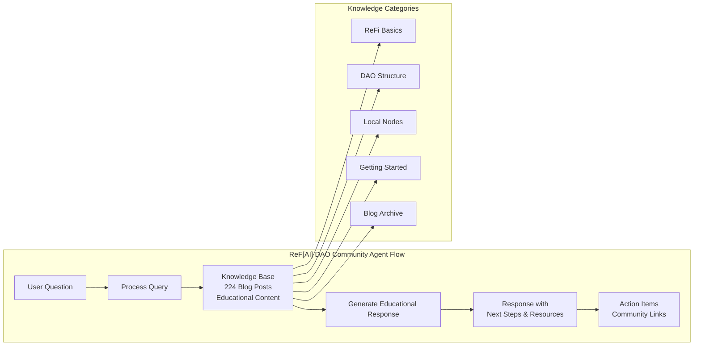
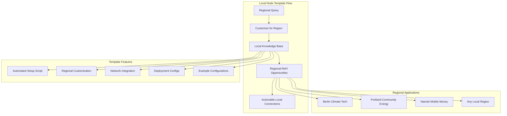
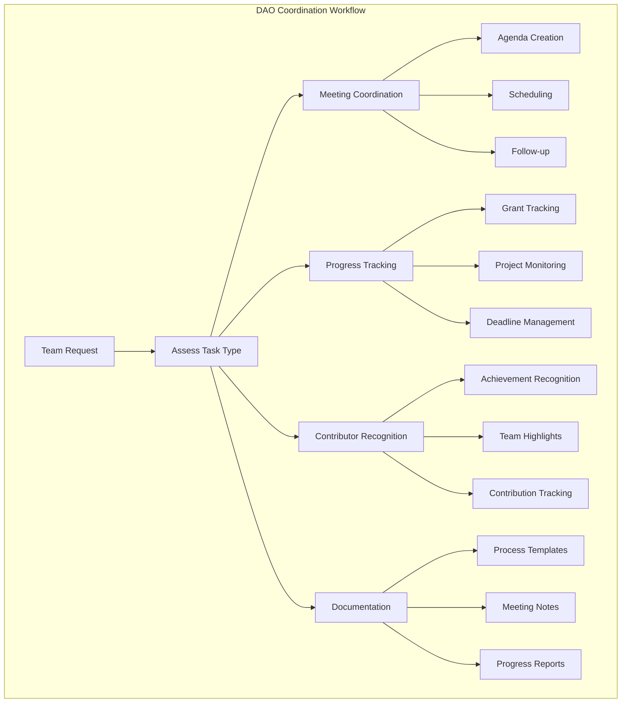
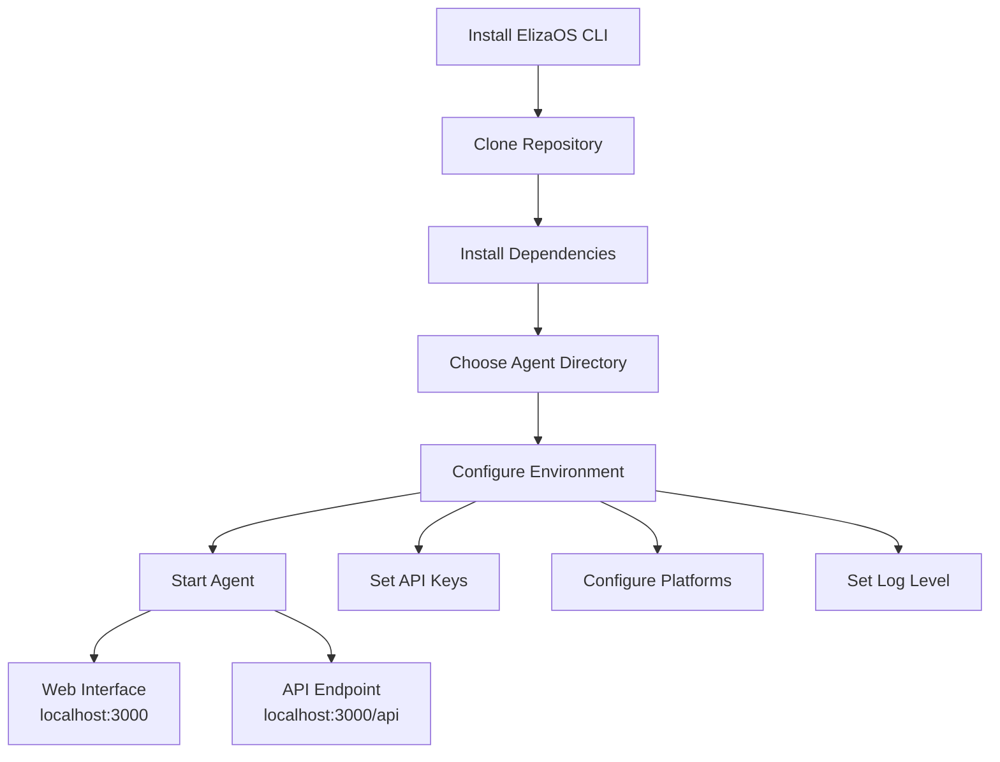
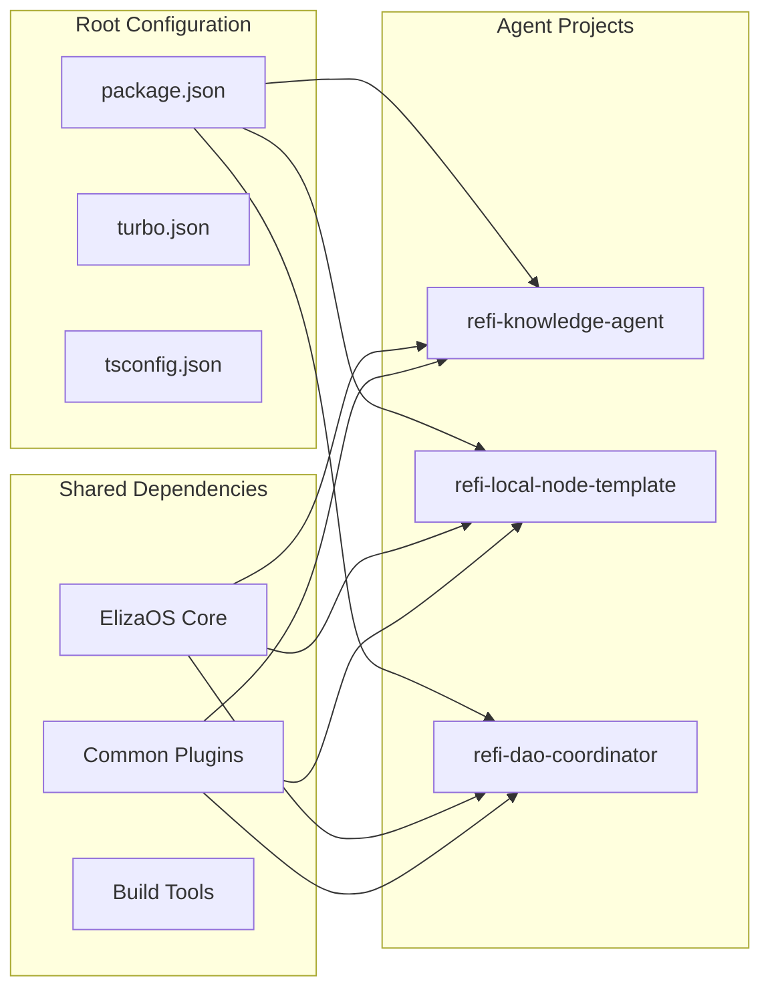
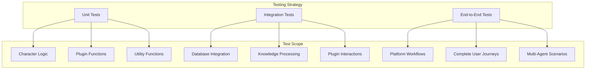
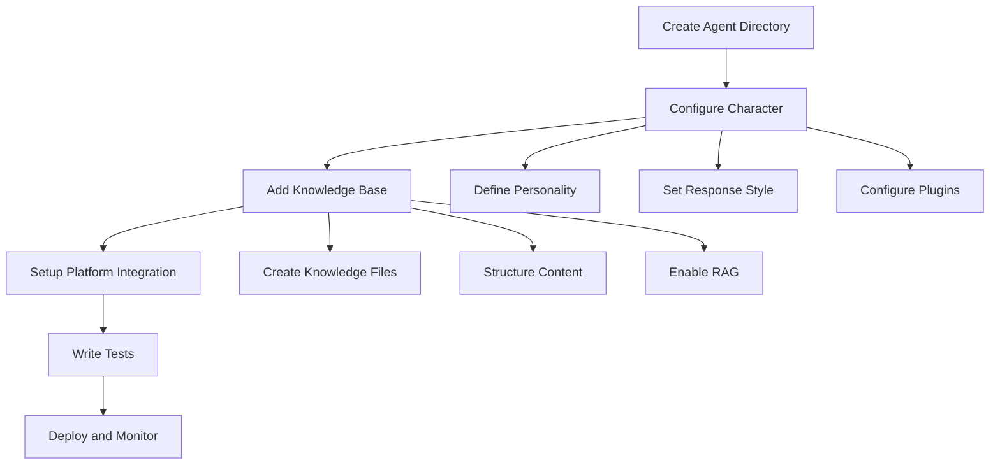
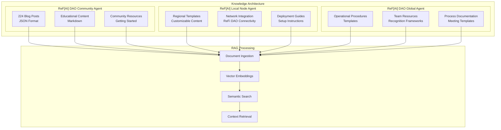

# ReFi Agent Ecosystem

A comprehensive framework for ReFi (Regenerative Finance) AI agents built on ElizaOS, designed to support the regenerative finance ecosystem through specialized AI assistants.

## 🌱 Project Overview

This repository contains a collection of specialized AI agents focused on regenerative finance, sustainability, and community coordination. Each agent is designed to serve specific roles within the ReFi ecosystem, from education and community building to operational coordination.

```mermaid
graph TB
    subgraph "ReFi Agent Ecosystem"
        KA[🎓 ReF[AI] DAO Community Agent<br/>External Q&A & Education]
        LNT[🌍 ReF[AI] Local Node Agent<br/>Regional Template]
        CA[🤝 ReF[AI] DAO Global Agent<br/>Internal Operations]
    end
    
    subgraph "Target Audiences"
        EXT[External Users<br/>Newcomers & Community]
        REG[Regional Users<br/>Local Communities]
        INT[Internal Users<br/>DAO Team Members]
    end
    
    subgraph "Platforms"
        TW[Twitter/X]
        TG[Telegram]
        DC[Discord]
    end
    
    subgraph "Knowledge Sources"
        KB1[ReFi Education<br/>224 Blog Posts]
        KB2[Local Templates<br/>Regional Guides]
        KB3[Operations Manual<br/>Processes & Templates]
    end
    
    KA --> EXT
    LNT --> REG
    CA --> INT
    
    KA --> TW
    KA --> TG
    LNT --> TW
    LNT --> TG
    LNT --> DC
    CA --> TG
    CA --> DC
    
    KB1 --> KA
    KB2 --> LNT
    KB3 --> CA
```

## 📂 Repository Structure

```
refi-agent-ecosystem/
├── README.md                           # This file - project overview and setup
├── package.json                        # Root workspace configuration
├── turbo.json                          # Monorepo build configuration
├── tsconfig.json                       # TypeScript configuration
├── bunfig.toml                         # Bun package manager configuration
│
├── refi-knowledge-agent/               # 🎓 External Q&A and Education Agent
│   ├── src/
│   │   ├── refiKnowledgeAgent.ts      # Character definition for knowledge agent
│   │   ├── index.ts                   # Project entry point
│   │   ├── character.ts               # ElizaOS template (preserved)
│   │   ├── plugin.ts                  # Custom plugins
│   │   └── __tests__/                 # Test suites
│   ├── knowledge/                     # 📚 Knowledge base for ReFi education
│   │   ├── refi-basics/               # Core ReFi concepts
│   │   ├── refi-dao/                  # DAO structure and governance
│   │   ├── local-nodes/               # Regional community information
│   │   ├── getting-started/           # Onboarding guides
│   │   └── ReFi DAO Blog Posts/       # 224 curated blog posts
│   ├── README.md                      # Agent-specific documentation
│   └── package.json                   # Agent dependencies
│
├── refi-local-node-template/           # 🌍 ReF[AI] Local Node Agent
│   ├── src/
│   │   ├── character.ts               # Template character definition
│   │   ├── index.ts                   # Project entry point
│   │   ├── plugin.ts                  # Custom plugins
│   │   └── __tests__/                 # Test suites
│   ├── knowledge/                     # 📍 Template knowledge base
│   │   ├── local-region/              # Regional template content
│   │   ├── refi/                      # ReFi-specific templates
│   │   └── basics/                    # Core concepts templates
│   ├── scripts/                       # 🛠️ Automation scripts
│   │   ├── setup-local-node.sh        # Interactive setup script
│   │   └── enhance-template.sh        # Advanced features script
│   ├── examples/                      # 📋 Example configurations
│   │   ├── berlin/                    # Berlin example
│   │   ├── portland/                  # Portland example
│   │   └── nairobi/                   # Nairobi example
│   ├── deployment/                    # 🚀 Deployment configurations
│   │   ├── docker/                    # Docker setup
│   │   ├── railway/                   # Railway deployment
│   │   └── fly/                       # Fly.io deployment
│   ├── docs/                          # 📚 Comprehensive documentation
│   │   ├── TEMPLATE_USAGE.md          # Usage guide
│   │   ├── NETWORK_INTEGRATION.md     # Network integration
│   │   ├── COMPREHENSIVE_GUIDE.md     # Complete guide
│   │   └── CONTRIBUTING.md            # Contribution guidelines
│   ├── README.md                      # Template documentation
│   └── package.json                   # Template dependencies
│
├── refi-dao-coordinator/               # 🤝 Internal Operations Coordinator Agent
│   ├── src/
│   │   ├── refiDaoCoordinator.ts      # Character definition for coordinator
│   │   ├── index.ts                   # Project entry point
│   │   ├── character.ts               # ElizaOS template (preserved)
│   │   ├── plugin.ts                  # Custom plugins
│   │   └── __tests__/                 # Test suites
│   ├── knowledge/                     # 📋 Operational knowledge base
│   │   ├── operations/                # Basic operations and procedures
│   │   ├── coordination/              # Contributor recognition systems
│   │   └── processes/                 # Meeting and workflow templates
│   ├── README.md                      # Agent-specific documentation
│   └── package.json                   # Agent dependencies
│
├── my-agent/                           # 🧪 Development/Test Agent (ElizaOS default)
│   └── ...                            # Standard ElizaOS project structure
│
├── packages/                           # 📦 Core ElizaOS Framework
│   ├── core/                          # ElizaOS core runtime
│   ├── cli/                           # Command-line interface
│   ├── client/                        # Web interface
│   ├── plugin-bootstrap/              # Essential communication plugins
│   ├── plugin-sql/                    # Database integration
│   └── ...                            # Additional core packages
│
├── scripts/                            # 🛠️ Build and development scripts
├── .github/                           # GitHub Actions and workflows
├── .vscode/                           # VS Code configuration
└── docs/                              # Additional documentation
```

## 🤖 Agent Specifications

### 1. ReF[AI] DAO Community Agent (External-Facing)
**Location**: `refi-knowledge-agent/`
**Purpose**: Educational Q&A assistant for ReFi concepts and community onboarding

**Character Definition**: `refi-knowledge-agent/src/refiKnowledgeAgent.ts`



**Core Capabilities**:
- **Knowledge Base**: Comprehensive ReFi education content and DAO documentation
- **Target Audience**: Newcomers and community members seeking ReFi education
- **Primary Platforms**: Twitter, Telegram (public channels)
- **Response Style**: Educational, encouraging, accessible to beginners

**Key Features**:
- Answers common questions about ReFi concepts and terminology
- Guides users through getting started with ReFi DAO participation
- Explains Local Nodes and community engagement opportunities
- Provides clear explanations of complex financial concepts
- Connects users with relevant resources and next steps

**Knowledge Sources**:
- ReFi basics and terminology (`knowledge/refi-basics/`)
- ReFi DAO overview and structure (`knowledge/refi-dao/`)
- Local Nodes introduction and participation (`knowledge/local-nodes/`)
- Community onboarding guides (`knowledge/getting-started/`)
- 224 ReFi DAO blog posts for comprehensive context (`knowledge/ReFi DAO Blog Posts/`)

**Settings**:
```typescript
settings: {
  ragKnowledge: true,
  responseMode: 'educational',
  maxResponseLength: 800,
  supportedLanguages: ['en'],
}
```

### 2. ReF[AI] Local Node Agent (Regional Template)
**Location**: `refi-local-node-template/`
**Purpose**: Comprehensive template for creating region-specific ReFi agents

**Character Definition**: `refi-local-node-template/src/character.ts`



**Core Capabilities**:
- **Template System**: Complete framework for regional ReFi agent creation
- **Target Audience**: Local communities wanting to create ReFi agents
- **Primary Platforms**: Discord, Twitter, Telegram (configurable)
- **Response Style**: Customizable based on regional context

**Key Features**:
- **Automated Setup**: Interactive script for quick regional customization
- **Comprehensive Documentation**: Complete guides for setup and deployment
- **Network Integration**: Built-in ReFi DAO network connectivity
- **Multi-Platform Support**: Discord, Twitter, Telegram integrations
- **Deployment Ready**: Docker, Railway, Fly.io configurations
- **Example Configurations**: Berlin, Portland, Nairobi examples

**Template Components**:
- **Setup Scripts**: Automated customization for any region
- **Knowledge Templates**: Structured templates for regional content
- **Deployment Configurations**: Production-ready deployment options
- **Network Integration**: ReFi DAO network connectivity
- **Monitoring & Analytics**: Built-in health checks and metrics
- **Security Features**: Rate limiting, input validation, CORS

**Settings**:
```typescript
settings: {
  ragKnowledge: true,
  responseMode: 'regional',
  maxResponseLength: 1000,
  supportedLanguages: ['en'],
  networkIntegration: true,
  monitoring: true,
}
```

### 3. ReF[AI] DAO Global Agent (Internal Operations)
**Location**: `refi-dao-coordinator/`
**Purpose**: Internal coordination assistant for ReFi DAO organizational tasks

**Character Definition**: `refi-dao-coordinator/src/refiDaoCoordinator.ts`



**Core Capabilities**:
- **Internal Focus**: DAO operations, team coordination, and process management
- **Target Audience**: ReFi DAO team members and contributors
- **Primary Platforms**: Telegram (private channels), Discord (internal)
- **Response Style**: Organized, professional, efficient

**Key Features**:
- Meeting agenda creation and coordination
- Progress tracking for grants and projects
- Contributor recognition and achievement tracking
- Task management and workflow optimization
- Documentation organization and maintenance
- Financial reporting assistance
- Team collaboration facilitation

**Operational Areas**:
- Meeting coordination and agenda management (`knowledge/operations/`)
- Contributor recognition systems (`knowledge/coordination/`)
- Process templates and workflows (`knowledge/processes/`)
- Task and project progress monitoring
- Internal communication optimization
- Documentation and process improvement
- Team workflow coordination

**Settings**:
```typescript
settings: {
  responseMode: 'organized',
  maxResponseLength: 1000,
  avatar: 'https://elizaos.github.io/eliza-avatars/Eliza/portrait.png',
}
```

## 🚀 Quick Start

### Prerequisites

- [Node.js](https://nodejs.org/) (v23 or higher recommended)
- [bun](https://bun.sh/docs/installation)

> **Note for Windows Users:** [WSL 2](https://learn.microsoft.com/en-us/windows/wsl/install-manual) is required.

### Setup Instructions



#### 1. Install the ElizaOS CLI

```bash
# Install the ElizaOS CLI globally
bun install -g @elizaos/cli

# Verify installation
elizaos --version
```

#### 2. Clone and Setup the Project

```bash
# Clone the repository
git clone https://github.com/ReFiDAO/regen_eliza-refi_dao.git
cd regen-eliza

# Install root dependencies
bun install

# Choose your agent and navigate to its directory
cd refi-knowledge-agent  # or refi-local-node-template, refi-dao-coordinator
```

#### 3. Configure Environment Variables

```bash
# Edit your environment configuration
elizaos env edit-local

# Or manually edit the .env file
nano .env
```

**Essential Environment Variables:**

```bash
# Required: Your model API key (choose one or more)
OPENAI_API_KEY=your_openai_key_here
ANTHROPIC_API_KEY=your_anthropic_key_here
GOOGLE_GENERATIVE_AI_API_KEY=your_google_key_here

# Platform integrations (based on agent purpose)
DISCORD_APPLICATION_ID=your_discord_app_id
DISCORD_API_TOKEN=your_discord_bot_token
TWITTER_API_KEY=your_twitter_key
TWITTER_API_SECRET_KEY=your_twitter_secret
TELEGRAM_BOT_TOKEN=your_telegram_token

# Optional: Logging and debugging
LOG_LEVEL=info
```

#### 4. Start Your Agent

```bash
# Build and start the agent
elizaos start

# Or start with debug logging for development
LOG_LEVEL=debug elizaos start
```

After starting, your agent will be available at:
- **Web Interface**: http://localhost:3000
- **API Endpoint**: http://localhost:3000/api

## 🏗️ Architecture

### Core Components

```mermaid
graph TB
    subgraph "ElizaOS Architecture"
        subgraph "Agent Layer"
            A1[ReF[AI] DAO Community Agent]
            A2[ReF[AI] Local Node Agent]  
            A3[ReF[AI] DAO Global Agent]
        end
        
        subgraph "Plugin System"
            P1[SQL Plugin]
            P2[Knowledge Plugin]
            P3[Platform Plugins]
            P4[Bootstrap Plugin]
        end
        
        subgraph "Platform Connectors"
            PC1[Discord Connector]
            PC2[Twitter Connector]
            PC3[Telegram Connector]
        end
        
        subgraph "Core Runtime"
            CR1[AgentRuntime]
            CR2[Memory System]
            CR3[LLM Integration]
        end
        
        subgraph "Knowledge Base"
            KB1[RAG Processing]
            KB2[Document Store]
            KB3[Vector Search]
        end
    end
    
    A1 --> P1
    A1 --> P2
    A2 --> P1
    A2 --> P2
    A3 --> P1
    
    P3 --> PC1
    P3 --> PC2
    P3 --> PC3
    
    A1 --> CR1
    A2 --> CR1
    A3 --> CR1
    
    CR1 --> CR2
    CR1 --> CR3
    
    P2 --> KB1
    KB1 --> KB2
    KB1 --> KB3
```

Each agent is built using ElizaOS core components:

- **Character Definition**: Personality, knowledge, and behavior configuration
- **Plugin System**: Modular capabilities (SQL, knowledge, platform integrations)
- **Knowledge Base**: RAG-enabled document processing for specialized knowledge
- **Platform Connectors**: Discord, Twitter, Telegram integrations
- **Runtime Environment**: ElizaOS agent runtime with full feature support

### Plugin Configuration

All agents use a common plugin stack:

```typescript
plugins: [
  '@elizaos/plugin-sql',           // Database integration
  '@elizaos/plugin-knowledge',     // RAG knowledge processing (where applicable)
  '@elizaos/plugin-openai',        // OpenAI model integration
  '@elizaos/plugin-anthropic',     // Anthropic model integration
  '@elizaos/plugin-discord',       // Discord platform integration
  '@elizaos/plugin-twitter',       // Twitter platform integration
  '@elizaos/plugin-telegram',      // Telegram platform integration
  '@elizaos/plugin-bootstrap',     // Core functionality
]
```

### Monorepo Structure



This project uses a monorepo structure with:
- **Root Configuration**: Shared TypeScript, Bun, and Turbo configurations
- **Individual Agents**: Self-contained projects with their own dependencies
- **Shared Dependencies**: Core ElizaOS packages shared across all agents
- **Build System**: Turbo for efficient building and development

## 🧪 Testing

### Running Tests

```bash
# Run all tests for an agent
elizaos test

# Run specific test types
elizaos test component      # Unit/component tests
elizaos test e2e           # End-to-end integration tests

# Run tests with specific patterns
elizaos test --name "knowledge"
```

### Test Structure



Each agent includes comprehensive test suites:

- **Unit Tests**: Individual component testing with mocks
- **Integration Tests**: Full agent runtime testing with live database
- **E2E Tests**: Complete workflow testing across platforms

## 🔧 Development

### Adding New Agents



1. **Create Agent Directory**:
   ```bash
   elizaos create my-new-agent --type project
   ```

2. **Configure Character**:
   - Edit `src/character.ts` with agent-specific personality and knowledge
   - Update `src/index.ts` to reference your character
   - Add knowledge files to `knowledge/` directory if needed

3. **Test and Deploy**:
   ```bash
   elizaos test
   elizaos start
   ```

### Using the Local Node Template

The ReF[AI] Local Node Agent provides a comprehensive starting point for creating region-specific agents:

1. **Setup a New Local Node**:
   ```bash
   cd refi-local-node-template
   ./scripts/setup-local-node.sh
   # Follow the interactive prompts to customize for your region
   ```

2. **Customize for Your Region**:
   - Update agent identity and regional context
   - Add local organizations and initiatives
   - Configure regional knowledge base
   - Set up platform integrations

3. **Deploy Your Local Node**:
   ```bash
   elizaos start
   # Your regional agent is now ready!
   ```

### Customizing Existing Agents

1. **Character Modifications**: Update personality, topics, or style in character files
2. **Knowledge Updates**: Add or modify files in the `knowledge/` directory
3. **Plugin Extensions**: Add custom plugins in `src/plugin.ts`
4. **Platform Configuration**: Update environment variables for new platforms

### Development Workflow

```bash
# From the root directory
bun install                    # Install all dependencies

# Navigate to specific agent
cd refi-knowledge-agent

# Development cycle
elizaos test                   # Test changes
elizaos start                  # Start for manual testing
LOG_LEVEL=debug elizaos start  # Debug mode
```

## 📚 Knowledge Management



### ReF[AI] DAO Community Agent
- **Blog Posts**: 224 curated ReFi DAO blog posts in JSON format
- **Educational Content**: Basic ReFi concepts and getting started guides
- **Community Resources**: Local Node information and participation guides

### ReF[AI] Local Node Agent
- **Template Content**: Structured templates for regional customization
- **Network Integration**: Built-in ReFi DAO network connectivity
- **Deployment Resources**: Complete setup and deployment guides
- **Example Configurations**: Berlin, Portland, Nairobi examples

### ReF[AI] DAO Global Agent
- **Operational Knowledge**: Internal processes and coordination procedures
- **Team Resources**: Contributor guidelines and recognition frameworks
- **Process Documentation**: Meeting templates and progress tracking systems

## 🤝 Contributing

### Guidelines

1. **Follow ElizaOS Standards**: Use the established plugin and character patterns
2. **Comprehensive Testing**: Include unit, integration, and E2E tests
3. **Documentation**: Update README and character documentation
4. **Knowledge Curation**: Ensure knowledge bases are accurate and up-to-date

### Development Workflow

```bash
# 1. Make changes to character definitions or knowledge
# 2. Test changes locally
elizaos test

# 3. Start agent for manual testing
elizaos start

# 4. Verify all platforms work correctly
# 5. Submit changes for review
```

## 🔗 Related Resources

- **ElizaOS Documentation**: [Official ElizaOS Docs](https://elizaos.github.io/eliza/)
- **ReFi DAO**: [ReFi DAO Official Website](https://www.refidao.com/)
- **Plugin Registry**: [ElizaOS Plugin Registry](https://github.com/elizaos-plugins/registry)
- **Community**: [ElizaOS Discord](https://discord.gg/elizaos)

## 📄 License

This project is licensed under the MIT License - see the LICENSE file for details.

## 🙏 Acknowledgments

Built on the ElizaOS framework by the ElizaOS team and contributors. Special thanks to the ReFi DAO community for guidance on regenerative finance concepts and use cases.
