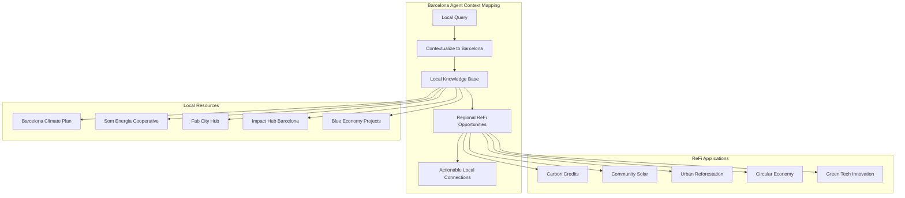

# ReFi Barcelona Agent

An ElizaOS agent specialized in Regenerative Finance (ReFi) and Barcelona's sustainability ecosystem. This agent combines deep knowledge of regenerative economic models with local expertise about Barcelona's green economy, climate initiatives, and innovation ecosystem.

## Overview

ReFi Barcelona is an AI agent designed to:
- **Educate** users about regenerative finance concepts and applications
- **Connect** people with Barcelona's sustainability initiatives and local organizations  
- **Guide** individuals and organizations in implementing ReFi projects
- **Bridge** traditional finance with innovative regenerative approaches
- **Promote** community-driven environmental and social impact

## Features

### 🧠 Knowledge Base
The agent includes comprehensive knowledge about:
- **ReFi Fundamentals**: Core principles, mechanisms, and technology stack
- **Barcelona Sustainability**: Local climate plans, energy cooperatives, circular economy initiatives
- **Getting Started**: Practical guides for individuals, organizations, and investors
- **Case Studies**: Real-world ReFi projects and applications
- **Local Resources**: Organizations, events, funding opportunities, and networks

### 🤖 Capabilities
- Expert-level conversations about regenerative finance
- Local context for Barcelona's green economy
- Practical guidance for getting involved in ReFi
- Connection to relevant local initiatives and organizations
- Educational content accessible to both beginners and experts

### 🔧 Technical Features
- **Knowledge Plugin**: RAG-enabled document search and retrieval
- **OpenAI Integration**: Advanced language understanding and generation
- **Web Interface**: Accessible through browser at http://localhost:3000
- **Real-time Learning**: Continuous knowledge base updates

## Quick Start

### Prerequisites
- Node.js 18+ or Bun
- OpenAI API key

### Installation & Setup

1. **Navigate to the project directory:**
   ```bash
   cd refi-barcelona
   ```

2. **Install dependencies:**
   ```bash
   bun install
   ```

3. **Configure environment:**
   The `.env` file is already configured with the necessary settings:
   - `OPENAI_API_KEY`: Your OpenAI API key (already set)
   - `LOAD_DOCS_ON_STARTUP=true`: Enables automatic knowledge loading
   - `PGLITE_DATA_DIR`: Local database path

4. **Build the agent:**
   ```bash
   bun run build
   ```

5. **Start the agent:**
   ```bash
   elizaos start
   ```

6. **Access the web interface:**
   Open http://localhost:3000 in your browser

## Knowledge Base

The agent's knowledge is organized in the `knowledge/` directory:

```
knowledge/
├── basics/
│   └── what-is-refi.md           # Comprehensive ReFi introduction
├── barcelona/
│   └── barcelona-sustainability-initiatives.md  # Local context and opportunities
└── refi/
    ├── getting-started-refi-barcelona.md        # Practical involvement guide
    └── refi-projects-case-studies.md            # Real-world examples
```

### Knowledge Topics Include:
- **ReFi Concepts**: Principles, mechanisms, technology, applications
- **Barcelona Context**: Climate plans, energy cooperatives, circular economy
- **Practical Guidance**: How to get involved, organizations to join, career paths
- **Case Studies**: Global and Barcelona-relevant project examples
- **Resources**: Local organizations, events, funding opportunities

## Usage Examples

### For Individuals
- "How can I get involved in Barcelona's sustainability scene?"
- "What is regenerative finance and how does it work?"
- "Are there any local energy cooperatives I can join?"
- "What career opportunities exist in ReFi?"

### For Organizations
- "How can our business implement ReFi principles?"
- "What are some successful circular economy projects in Barcelona?"
- "How do we measure and tokenize environmental impact?"
- "What local partners should we connect with?"

### For Investors
- "What ReFi investment opportunities exist in Barcelona?"
- "How do I evaluate impact investments?"
- "What are the key success factors for ReFi projects?"
- "Where can I find green bonds and impact funds?"

## Character Configuration

The agent is configured with:
- **Name**: ReFi Barcelona
- **Expertise**: Regenerative finance, sustainability, Barcelona green economy
- **Plugins**: Knowledge, OpenAI, SQL, Bootstrap
- **RAG Mode**: Enabled for intelligent document retrieval
- **Style**: Educational, inspiring, action-oriented, locally-relevant

## Development

### Adding Knowledge
To add new knowledge to the agent:

1. Create markdown files in the `knowledge/` directory
2. Restart the agent to reload documents
3. The knowledge plugin will automatically process and index new content

### Customization
- **Character**: Modify `src/character.ts` to adjust personality and behavior
- **Plugins**: Add additional plugins in the character configuration
- **Knowledge**: Expand the knowledge base with new documents
- **Settings**: Update `.env` for different configurations

## Local Organizations & Resources

The agent has knowledge about:
- **Som Energia**: Renewable energy cooperative
- **Fab City Barcelona**: Local production and circular economy
- **Impact Hub Barcelona**: Social innovation incubator
- **Barcelona Activa**: Municipal business development
- **22@ Innovation District**: Tech and sustainability startups
- **IAAC**: Institute for Advanced Architecture of Catalonia

## Architecture

Built on ElizaOS with:
- **Core Runtime**: Agent execution and management
- **Knowledge Plugin**: RAG-powered document search
- **OpenAI Plugin**: Language understanding and generation
- **SQL Plugin**: Local database for memory and knowledge storage
- **Bootstrap Plugin**: Core message handling and interactions

## Contributing

To contribute to the ReFi Barcelona agent:
1. Add new knowledge documents to the `knowledge/` directory
2. Update character configuration for new capabilities
3. Test changes with the local development environment
4. Submit improvements and expansions

## License

This project follows the ElizaOS licensing terms.

## Support

For questions about:
- **ReFi concepts**: Ask the agent directly
- **Barcelona resources**: The agent has extensive local knowledge
- **Technical issues**: Check ElizaOS documentation
- **Local involvement**: Agent can connect you with relevant organizations

---

**Ready to explore regenerative finance in Barcelona? Start chatting with the agent at http://localhost:3000!**

## 🔧 Plugin Configuration

The ReFi Barcelona Agent uses the following ElizaOS plugins with conditional loading based on environment variables:

```typescript
plugins: [
  // Core Database & Knowledge Infrastructure
  '@elizaos/plugin-sql',                    // Database storage for conversations & memory
  '@elizaos/plugin-knowledge',              // RAG processing for Barcelona-specific content
  
  // LLM Providers (Conditional Loading)
  ...(process.env.ANTHROPIC_API_KEY ? ['@elizaos/plugin-anthropic'] : []),
  ...(process.env.OPENROUTER_API_KEY ? ['@elizaos/plugin-openrouter'] : []),
  ...(process.env.OPENAI_API_KEY ? ['@elizaos/plugin-openai'] : []),
  ...(process.env.GOOGLE_GENERATIVE_AI_API_KEY ? ['@elizaos/plugin-google-genai'] : []),
  ...(process.env.OLLAMA_API_ENDPOINT ? ['@elizaos/plugin-ollama'] : []),
  
  // Platform Integrations (Multi-platform for local community)
  ...(process.env.DISCORD_API_TOKEN ? ['@elizaos/plugin-discord'] : []),
  ...(process.env.TWITTER_API_KEY ? ['@elizaos/plugin-twitter'] : []),
  ...(process.env.TELEGRAM_BOT_TOKEN ? ['@elizaos/plugin-telegram'] : []),
  
  // Core Functionality
  '@elizaos/plugin-bootstrap',              // Essential agent behaviors
]
```

## 📊 Data Flow Architecture

```mermaid
graph TB
    subgraph "🔌 Input Channels"
        I1[Discord Server]
        I2[Twitter Local Feed]
        I3[Telegram Groups]
        I4[Direct Inquiries]
    end
    
    subgraph "🧠 Core Agent"
        A1[ReFi Barcelona Agent]
        A2[Character: Regional Expert]
        A3[Focus: Local Context]
    end
    
    subgraph "🔧 Plugins & Capabilities"
        P1[SQL Database]
        P2[Knowledge RAG]
        P3[LLM Providers]
        P4[Multi-Platform]
        P5[Bootstrap Core]
    end
    
    subgraph "📍 Local Knowledge"
        K1[Barcelona Climate Plan]
        K2[Local Organizations]
        K3[Regional Projects]
        K4[Sustainability Hub]
        K5[Community Resources]
    end
    
    subgraph "🌱 ReFi Integration"
        R1[Carbon Markets]
        R2[Tokenization]
        R3[Community Projects]
        R4[Impact Metrics]
    end
    
    subgraph "🤖 LLM Providers"
        L1[Anthropic Claude]
        L2[OpenAI GPT]
        L3[Google Gemini]
        L4[OpenRouter]
        L5[Ollama Local]
    end
    
    subgraph "📤 Output & Actions"
        O1[Localized Responses]
        O2[Community Connections]
        O3[Project Recommendations]
        O4[Action Steps]
    end
    
    subgraph "💾 Data Storage"
        D1[Local Context]
        D2[Community Data]
        D3[Project Database]
        D4[Regional Knowledge]
    end
    
    I1 --> A1
    I2 --> A1
    I3 --> A1
    I4 --> A1
    
    A1 --> P1
    A1 --> P2
    A1 --> P3
    A1 --> P4
    A1 --> P5
    
    P2 --> K1
    P2 --> K2
    P2 --> K3
    P2 --> K4
    P2 --> K5
    
    A1 --> R1
    A1 --> R2
    A1 --> R3
    A1 --> R4
    
    P3 --> L1
    P3 --> L2
    P3 --> L3
    P3 --> L4
    P3 --> L5
    
    A1 --> O1
    A1 --> O2
    A1 --> O3
    A1 --> O4
    
    P1 --> D1
    P1 --> D2
    P1 --> D3
    P1 --> D4
```



## 🏗️ Technical Architecture

### Core Components

The ReFi Barcelona Agent is built using ElizaOS core components:

- **Character Definition**: Regional expert personality, local knowledge, and Barcelona-focused behavior
- **Plugin System**: Modular capabilities (SQL, knowledge, multi-platform integrations)
- **Knowledge Base**: RAG-enabled document processing for Barcelona-specific content
- **Platform Connectors**: Discord, Twitter, Telegram integrations for local community engagement
- **Runtime Environment**: ElizaOS agent runtime with full feature support

### Local Context Processing Flow



---
