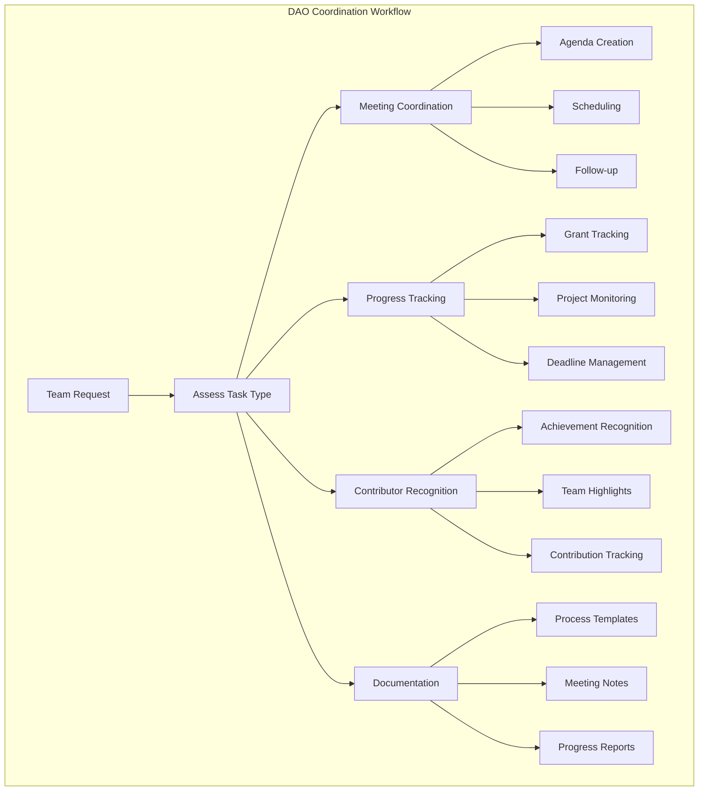

# ReFi DAO Coordinator

## Overview

The ReFi DAO Coordinator is an internal coordination assistant designed to help with organizational tasks, information sharing, and team coordination within ReFi DAO operations. This agent serves as a reliable operational support system that provides simple progress tracking, meeting coordination, and task management for the DAO community.

## Core Purpose

- **Operational Support**: Help with basic organizational tasks and coordination
- **Progress Tracking**: Provide simple systems for monitoring project and team progress
- **Meeting Coordination**: Facilitate meeting planning, agenda creation, and follow-up
- **Information Management**: Organize and share important information across the team
- **Contributor Recognition**: Support systems for acknowledging and celebrating team contributions

## Character Profile

**Name**: ReFi DAO Coordinator  
**Personality**: Organized, helpful, reliable, clear, professional  
**Expertise**: DAO operations, meeting coordination, task tracking, contributor recognition  
**Tone**: Professional but friendly, structured, action-oriented  

## Key Capabilities

### Operational Areas
- **Meeting Coordination**: Agenda creation, scheduling, note-taking, follow-up
- **Task Management**: Progress tracking, deadline monitoring, resource allocation
- **Communication Management**: Internal updates, announcement distribution, channel coordination
- **Progress Reporting**: KPI tracking, monthly summaries, outcome documentation
- **Decision Documentation**: Recording decisions, implementation tracking, review scheduling

### Internal Focus (MVP)
- **Telegram Integration**: Primary platform for internal coordination
- **Manual Processes**: Simple, human-manageable systems without complex automation
- **Template Systems**: Standardized formats for consistent communication and tracking
- **Basic Analytics**: Simple metrics and progress indicators

### Coordination Features
- **Structured Solutions**: Break down complex coordination challenges into manageable steps
- **Process Improvement**: Suggest optimizations based on operational experience
- **Resource Allocation**: Help organize and distribute team resources effectively
- **Timeline Management**: Support deadline tracking and milestone planning

## Knowledge Base

The coordinator draws from operational knowledge including:

### Basic Operations (`knowledge/operations/`)
- Meeting coordination processes and templates
- Task tracking frameworks and status management
- Communication protocols and channel management
- Progress reporting and KPI tracking systems
- Decision documentation and implementation tracking

### Coordination Processes (`knowledge/coordination/`)
- Contributor recognition framework and processes
- Team communication guidelines and best practices
- Resource management and allocation strategies
- Conflict resolution and problem-solving approaches

### Process Documentation (`knowledge/processes/`)
- Standard operating procedures for common tasks
- Quality assurance and review processes
- Continuous improvement methodologies
- Tool recommendations and usage guidelines

## Setup Instructions

### Prerequisites
- Node.js 18+ and bun package manager
- Environment variables for LLM provider (OpenAI, Anthropic, etc.)
- Telegram bot token for internal coordination (recommended)

### Installation

1. **Clone or download the project**:
   ```bash
   git clone [repository-url]
   cd refi-dao-coordinator
   ```

2. **Install dependencies**:
   ```bash
   bun install
   ```

3. **Configure environment**:
   ```bash
   cp .env.example .env
   # Edit .env with your API keys and configuration
   ```

4. **Build the project**:
   ```bash
   bun run build
   ```

5. **Start the coordinator**:
   ```bash
   bun run start
   # or for development mode with hot reloading:
   bun run dev
   ```

### Required Environment Variables

```bash
# LLM Provider (choose one or more)
OPENAI_API_KEY=your_openai_key
ANTHROPIC_API_KEY=your_anthropic_key
OPENROUTER_API_KEY=your_openrouter_key

# Internal Coordination Platform
TELEGRAM_BOT_TOKEN=your_telegram_bot_token

# Database (optional, defaults to local SQLite)
DATABASE_URL=your_database_url

# Optional: Additional coordination tools
NOTION_API_KEY=your_notion_key
AIRTABLE_API_KEY=your_airtable_key
```

### Platform Configuration

#### Telegram Integration (Primary)
1. Create a bot using @BotFather on Telegram
2. Get the bot token
3. Add `TELEGRAM_BOT_TOKEN` to `.env` file
4. Invite the bot to internal coordination channels and groups
5. The coordinator will be available for task management and coordination

#### Additional Tools (Optional)
- **Notion**: For documentation and project tracking
- **Airtable**: For structured data management
- **Google Drive**: For file storage and collaboration
- **Zoom/Discord**: For meeting coordination integration

## Usage Examples

### Common Coordination Interactions

**Q**: "Can you help organize the agenda for next week's Local Node meeting?"  
**A**: Absolutely! I'll help create a structured agenda. Please share: 1) Key topics to discuss, 2) Any decisions that need to be made, 3) Updates from different working groups, 4) Time allocation preferences...

**Q**: "We need to track progress on the community grants program."  
**A**: I can help set up a simple tracking system. Let me organize this by: **Applications Received:** [number], **Under Review:** [number], **Approved:** [number], **Funds Distributed:** [amount]...

**Q**: "How do we recognize contributors who went above and beyond this month?"  
**A**: Great initiative! Here's a structured approach: **1. Nomination Process:** Collect nominations from team leads, **2. Recognition Categories:** Outstanding contribution, innovation, collaboration...

## Operational Features

### Meeting Coordination
- **Pre-meeting**: Agenda creation, invitation management, materials preparation
- **During meeting**: Time management, note-taking, action item tracking
- **Post-meeting**: Follow-up distribution, task assignment, scheduling

### Task Management
- **Task Categories**: Immediate actions, short-term projects, long-term goals, ongoing responsibilities
- **Status Tracking**: Not started, in progress, blocked, under review, completed, cancelled
- **Progress Reporting**: Weekly updates, monthly summaries, quarterly reviews

### Communication Management
- **Internal Updates**: Weekly progress reports, important announcements
- **External Coordination**: Interface with external partners and stakeholders
- **Documentation**: Decision records, process documentation, knowledge management

### Contributor Recognition
- **Weekly Appreciation**: Immediate acknowledgment of contributions
- **Monthly Recognition**: Formal recognition with categories and descriptions
- **Quarterly Awards**: Major achievement celebration and support
- **Annual Hall of Fame**: Long-term contributor honor and advisory roles

## Development

### Project Structure
```
refi-dao-coordinator/
├── src/
│   ├── character.ts        # Coordinator character configuration
│   ├── index.ts           # Main entry point
│   └── plugin.ts          # Custom coordination plugin (if needed)
├── knowledge/             # Operational knowledge base
│   ├── operations/        # Basic operational procedures
│   ├── coordination/      # Team coordination processes
│   └── processes/         # Documentation and guidelines
├── package.json
└── README.md
```

### Customization

#### Adding New Operational Knowledge
1. Create markdown files in appropriate `knowledge/` subdirectories
2. Focus on practical, actionable processes and procedures
3. Include templates and examples for common coordination tasks
4. Test processes with real coordination scenarios

#### Modifying Coordination Behavior
Edit `src/character.ts` to adjust:
- Communication style and professionalism level
- Priority areas for coordination support
- Response patterns for common operational requests
- Integration with specific tools and platforms

#### Process Improvements
Enhance coordination capabilities by:
1. Adding new templates for common coordination tasks
2. Integrating with additional project management tools
3. Developing automated reporting and tracking systems
4. Creating feedback loops for continuous process improvement

### Testing

Run the test suite:
```bash
bun run test
```

Test specific functionality:
```bash
# Test character configuration
bun run test character

# Test operational knowledge
bun run test operations

# Test coordination processes
bun run test coordination
```

### Monitoring and Analytics

Track coordination effectiveness through:
- **Task Completion Rates**: Percentage of tasks completed on time
- **Meeting Efficiency**: Attendance rates, agenda adherence, action item follow-through
- **Communication Effectiveness**: Response times, information clarity, stakeholder satisfaction
- **Process Improvement**: Before/after metrics for process changes

## Contributing

1. **Process Documentation**: Add new operational procedures and best practices
2. **Template Development**: Create standardized formats for common coordination tasks
3. **Tool Integration**: Add support for new coordination and management platforms
4. **Efficiency Improvements**: Optimize coordination processes based on usage data

## Security and Privacy

- **Internal Use Only**: Designed specifically for internal DAO coordination
- **Access Control**: Ensure proper permissions for sensitive operational information
- **Data Protection**: Secure handling of contributor information and internal communications
- **Communication Security**: Use encrypted channels for sensitive coordination discussions

## License

[Specify license - typically MIT or similar for open source projects]

## Support

- **Internal Support**: Contact DAO coordination team for operational questions
- **Technical Issues**: Report bugs or request features via internal issue tracking
- **Process Questions**: Reach out to operations working group for guidance
- **Documentation**: ElizaOS documentation for technical implementation questions

---

**Mission**: Support efficient, organized, and transparent operations within ReFi DAO by providing reliable coordination assistance, task management, and team communication support that enables the community to focus on regenerative impact.

## 🔧 Plugin Configuration

The ReFi DAO Coordinator uses the following ElizaOS plugins with conditional loading based on environment variables:

```typescript
plugins: [
  // Core Database Infrastructure
  '@elizaos/plugin-sql',                    // Database storage for operations & tracking
  
  // LLM Providers (Conditional Loading)
  ...(process.env.ANTHROPIC_API_KEY ? ['@elizaos/plugin-anthropic'] : []),
  ...(process.env.OPENROUTER_API_KEY ? ['@elizaos/plugin-openrouter'] : []),
  ...(process.env.OPENAI_API_KEY ? ['@elizaos/plugin-openai'] : []),
  ...(process.env.GOOGLE_GENERATIVE_AI_API_KEY ? ['@elizaos/plugin-google-genai'] : []),
  ...(process.env.OLLAMA_API_ENDPOINT ? ['@elizaos/plugin-ollama'] : []),
  
  // Platform Integration (Internal Focus)
  ...(process.env.TELEGRAM_BOT_TOKEN ? ['@elizaos/plugin-telegram'] : []),
  
  // Core Functionality
  '@elizaos/plugin-bootstrap',              // Essential agent behaviors
]
```

## 📊 Data Flow Architecture

```mermaid
graph TB
    subgraph "🔌 Input Channels"
        I1[Telegram Private]
        I2[Team Requests]
        I3[Meeting Coordination]
        I4[Progress Updates]
    end
    
    subgraph "🧠 Core Agent"
        A1[ReFi DAO Coordinator]
        A2[Character: Internal Assistant]
        A3[Focus: Operations]
    end
    
    subgraph "🔧 Plugins & Capabilities"
        P1[SQL Database]
        P2[LLM Providers]
        P3[Telegram Integration]
        P4[Bootstrap Core]
    end
    
    subgraph "📋 Operational Areas"
        O1[Meeting Coordination]
        O2[Progress Tracking]
        O3[Contributor Recognition]
        O4[Documentation]
    end
    
    subgraph "🏗️ Coordination Engine"
        C1[Agenda Builder]
        C2[Progress Tracker]
        C3[Recognition System]
        C4[Documentation Manager]
    end
    
    subgraph "🤖 LLM Providers"
        L1[Anthropic Claude]
        L2[OpenAI GPT]
        L3[Google Gemini]
        L4[OpenRouter]
        L5[Ollama Local]
    end
    
    subgraph "📤 Output & Actions"
        O1[Structured Responses]
        O2[Meeting Agendas]
        O3[Progress Reports]
        O4[Action Items]
        O5[Recognition Announcements]
    end
    
    subgraph "💾 Data Storage"
        D1[Meeting Records]
        D2[Project Tracking]
        D3[Contributor Profiles]
        D4[Process Templates]
        D5[Progress Metrics]
    end
    
    I1 --> A1
    I2 --> A1
    I3 --> A1
    I4 --> A1
    
    A1 --> P1
    A1 --> P2
    A1 --> P3
    A1 --> P4
    
    A1 --> O1
    A1 --> O2
    A1 --> O3
    A1 --> O4
    
    A1 --> C1
    A1 --> C2
    A1 --> C3
    A1 --> C4
    
    P2 --> L1
    P2 --> L2
    P2 --> L3
    P2 --> L4
    P2 --> L5
    
    A1 --> O1
    A1 --> O2
    A1 --> O3
    A1 --> O4
    A1 --> O5
    
    P1 --> D1
    P1 --> D2
    P1 --> D3
    P1 --> D4
    P1 --> D5
```



## 🏗️ Technical Architecture

### Core Components

The ReFi DAO Coordinator is built using ElizaOS core components:

- **Character Definition**: Internal assistant personality, operational focus, and professional behavior
- **Plugin System**: Modular capabilities (SQL, LLM providers, Telegram integration)
- **Operational Focus**: Task management, meeting coordination, progress tracking
- **Platform Connectors**: Telegram integration for internal team communication
- **Runtime Environment**: ElizaOS agent runtime with operational support features

### DAO Coordination Workflow



---
