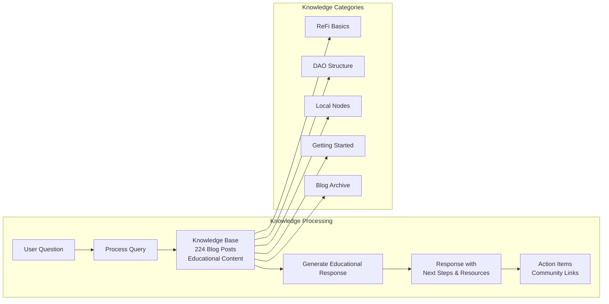

# ReF[AI] DAO Community Agent

## Overview

The ReF[AI] DAO Community Agent is an external-facing Q&A bot designed to help people understand regenerative finance (ReFi) concepts and get involved with ReFi DAO. This agent serves as a helpful educational guide that answers common questions about ReFi basics, ReFi DAO structure, Local Nodes, and how to participate in the regenerative finance movement.

## Core Purpose

- **Educational Guide**: Provide clear, accessible explanations of ReFi concepts
- **Community Onboarding**: Help newcomers understand how to get involved
- **Resource Connection**: Direct users to relevant projects, communities, and opportunities
- **Engagement Support**: Encourage participation in regenerative finance initiatives

## Character Profile

**Name**: ReF[AI] DAO Community Agent  
**Personality**: Helpful, educational, friendly, patient, encouraging  
**Expertise**: Regenerative finance basics, ReFi DAO overview, Local Nodes, community participation  
**Tone**: Simple, clear language with actionable next steps  

## Key Capabilities

### Knowledge Areas
- **ReFi Fundamentals**: Core concepts, principles, and differences from traditional finance
- **ReFi DAO Structure**: Governance, funding mechanisms, working groups
- **Local Nodes**: Regional communities, project types, how to start or join
- **Getting Started**: Practical steps for different types of participants
- **Community Resources**: Links to Discord, Telegram, events, and educational materials

### Platform Support (MVP)
- **Twitter/X**: Basic replies and mentions for educational outreach
- **Telegram**: Q&A in groups and DMs for community support
- **Discord**: Educational discussions and community engagement

### Response Capabilities
- **Educational Focus**: Break down complex concepts into simple explanations
- **Actionable Guidance**: Provide specific next steps for getting involved
- **Resource Sharing**: Connect users with relevant documentation and communities
- **Follow-up Questions**: Ask clarifying questions to better help users

## Knowledge Base

The agent draws from a comprehensive knowledge base including:

### ReFi Basics (`knowledge/refi-basics/`)
- What is ReFi and how it differs from traditional finance
- Core principles: regeneration, measurable impact, community-driven finance
- Key mechanisms: carbon credits, impact investing, blockchain transparency
- Common applications and success stories

### ReFi DAO Information (`knowledge/refi-dao/`)
- DAO structure, governance, and mission
- How the DAO works for different stakeholder types
- Key components: Local Nodes, grants, technology, education
- Getting involved: community member, contributor, funder, leader roles

### Local Nodes Guide (`knowledge/local-nodes/`)
- What Local Nodes are and how they work
- Types of projects: environmental restoration, renewable energy, agriculture
- Starting a new Local Node: process, resources, support
- Joining existing Nodes: ways to contribute and get involved

### Getting Started Resources (`knowledge/getting-started/`)
- Quick start guide for ReFi newcomers
- Step-by-step onboarding process
- Different participation paths based on interests and skills
- 30-day challenge for deeper engagement

## Setup Instructions

### Prerequisites
- Node.js 18+ and bun package manager
- Environment variables for LLM provider (OpenAI, Anthropic, etc.)
- Platform API keys for Twitter/Telegram (optional but recommended)

### Installation

1. **Clone or download the project**:
   ```bash
   git clone [repository-url]
   cd refi-knowledge-agent
   ```

2. **Install dependencies**:
   ```bash
   bun install
   ```

3. **Configure environment**:
   ```bash
   cp .env.example .env
   # Edit .env with your API keys and configuration
   ```

4. **Build the project**:
   ```bash
   bun run build
   ```

5. **Start the agent**:
   ```bash
   bun run start
   # or for development mode with hot reloading:
   bun run dev
   ```

### Required Environment Variables

```bash
# LLM Provider (choose one or more)
OPENAI_API_KEY=your_openai_key
ANTHROPIC_API_KEY=your_anthropic_key
OPENROUTER_API_KEY=your_openrouter_key

# Platform Integration (optional)
TWITTER_API_KEY=your_twitter_key
TWITTER_API_SECRET_KEY=your_twitter_secret
TWITTER_ACCESS_TOKEN=your_twitter_token
TWITTER_ACCESS_TOKEN_SECRET=your_twitter_token_secret

TELEGRAM_BOT_TOKEN=your_telegram_bot_token

# Database (optional, defaults to local SQLite)
DATABASE_URL=your_database_url
```

### Platform Configuration

#### Twitter Integration
1. Create a Twitter Developer account and app
2. Generate API keys and access tokens
3. Add credentials to `.env` file
4. The agent will automatically respond to mentions and DMs

#### Telegram Integration
1. Create a bot using @BotFather on Telegram
2. Get the bot token
3. Add `TELEGRAM_BOT_TOKEN` to `.env` file
4. The agent will be available for groups and private chats

## Usage Examples

### Common User Interactions

**Q**: "What is ReFi and how is it different from traditional finance?"  
**A**: ReFi (Regenerative Finance) goes beyond traditional finance by actively funding projects that regenerate ecosystems and communities. While traditional finance often prioritizes profit alone, ReFi creates measurable positive environmental and social impact alongside financial returns...

**Q**: "How can I get involved in the ReFi community?"  
**A**: Great question! Here are some practical steps to get started: 1) Join ReFi DAO Discord and Telegram communities, 2) Explore Local Nodes in your area for hands-on projects, 3) Attend ReFi events and workshops...

**Q**: "What are Local Nodes in ReFi DAO?"  
**A**: Local Nodes are regional communities within ReFi DAO that work on place-based regenerative projects. They connect global ReFi principles with local environmental and social needs...

## Development

### Project Structure
```
refi-knowledge-agent/
├── src/
│   ├── character.ts        # Agent character configuration
│   ├── index.ts           # Main entry point
│   └── plugin.ts          # Custom plugin (if needed)
├── knowledge/             # Knowledge base files
│   ├── refi-basics/       # Core ReFi concepts
│   ├── refi-dao/          # DAO structure and processes
│   ├── local-nodes/       # Local Node information
│   └── getting-started/   # Onboarding guides
├── package.json
└── README.md
```

### Customization

#### Adding New Knowledge
1. Create markdown files in appropriate `knowledge/` subdirectories
2. Use clear headings and structured information
3. Include specific examples and actionable guidance
4. Test with the agent to ensure knowledge is accessible

#### Modifying Character Behavior
Edit `src/character.ts` to adjust:
- Response style and tone
- Topic focus areas
- Platform-specific behaviors
- Example interactions

#### Platform Extensions
Add new platform integrations by:
1. Installing relevant ElizaOS plugin packages
2. Adding configuration to character plugins array
3. Setting up required environment variables
4. Testing platform-specific functionality

### Testing

Run the test suite:
```bash
bun run test
```

Test specific functionality:
```bash
# Test character configuration
bun run test character

# Test knowledge retrieval
bun run test knowledge

# Test platform integrations
bun run test platforms
```

## Contributing

1. **Knowledge Updates**: Submit new knowledge files or corrections via pull request
2. **Feature Improvements**: Enhance agent capabilities while maintaining educational focus
3. **Platform Support**: Add new communication platforms following MVP principles
4. **Testing**: Ensure all changes include appropriate tests

## License

[Specify license - typically MIT or similar for open source projects]

## Support

- **Issues**: Report bugs or request features via GitHub issues
- **Community**: Join the ReFi DAO Discord for community support
- **Documentation**: ElizaOS documentation for technical questions

---

**Mission**: Help people understand and participate in regenerative finance by providing accessible, educational, and actionable guidance about ReFi concepts and community involvement.

## 🔧 Plugin Configuration

The ReF[AI] DAO Community Agent uses the following ElizaOS plugins with conditional loading based on environment variables:

```typescript
plugins: [
  // Core Database & Knowledge Infrastructure
  '@elizaos/plugin-sql',                    // Database storage for conversations & memory
  '@elizaos/plugin-knowledge',              // RAG processing for 224+ ReFi documents
  
  // LLM Providers (Conditional Loading)
  ...(process.env.ANTHROPIC_API_KEY ? ['@elizaos/plugin-anthropic'] : []),
  ...(process.env.OPENROUTER_API_KEY ? ['@elizaos/plugin-openrouter'] : []),
  ...(process.env.OPENAI_API_KEY ? ['@elizaos/plugin-openai'] : []),
  ...(process.env.GOOGLE_GENERATIVE_AI_API_KEY ? ['@elizaos/plugin-google-genai'] : []),
  ...(process.env.OLLAMA_API_ENDPOINT ? ['@elizaos/plugin-ollama'] : []),
  
  // Platform Integrations
  ...(process.env.TWITTER_API_KEY ? ['@elizaos/plugin-twitter'] : []),
  ...(process.env.TELEGRAM_BOT_TOKEN ? ['@elizaos/plugin-telegram'] : []),
  
  // Core Functionality
  '@elizaos/plugin-bootstrap',              // Essential agent behaviors
]
```

## 📊 Data Flow Architecture

```mermaid
graph TB
    subgraph "🔌 Input Channels"
        I1[Twitter API]
        I2[Telegram Bot]
        I3[Direct Web Interface]
    end
    
    subgraph "🧠 Core Agent"
        A1[ReF[AI] DAO Community Agent]
        A2[Character: Educational Guide]
        A3[Response Mode: Educational]
    end
    
    subgraph "🔧 Plugins & Capabilities"
        P1[SQL Database]
        P2[Knowledge RAG]
        P3[LLM Providers]
        P4[Platform Connectors]
        P5[Bootstrap Core]
    end
    
    subgraph "📚 Knowledge Sources"
        K1[224 Blog Posts]
        K2[ReFi Basics]
        K3[DAO Structure]
        K4[Local Nodes]
        K5[Getting Started]
    end
    
    subgraph "🤖 LLM Providers"
        L1[Anthropic Claude]
        L2[OpenAI GPT]
        L3[Google Gemini]
        L4[OpenRouter]
        L5[Ollama Local]
    end
    
    subgraph "📤 Output & Actions"
        O1[Educational Responses]
        O2[Resource Links]
        O3[Community Connections]
        O4[Next Steps Guide]
    end
    
    subgraph "💾 Data Storage"
        D1[Conversation History]
        D2[User Interactions]
        D3[Knowledge Embeddings]
        D4[Response Templates]
    end
    
    I1 --> A1
    I2 --> A1
    I3 --> A1
    
    A1 --> P1
    A1 --> P2
    A1 --> P3
    A1 --> P4
    A1 --> P5
    
    P2 --> K1
    P2 --> K2
    P2 --> K3
    P2 --> K4
    P2 --> K5
    
    P3 --> L1
    P3 --> L2
    P3 --> L3
    P3 --> L4
    P3 --> L5
    
    A1 --> O1
    A1 --> O2
    A1 --> O3
    A1 --> O4
    
    P1 --> D1
    P1 --> D2
    P1 --> D3
    P1 --> D4
```

## 🏗️ Technical Architecture

### Core Components

The ReF[AI] DAO Community Agent is built using ElizaOS core components:

- **Character Definition**: Educational personality, knowledge, and behavior configuration
- **Plugin System**: Modular capabilities (SQL, knowledge, platform integrations)
- **Knowledge Base**: RAG-enabled document processing for 224+ ReFi documents
- **Platform Connectors**: Twitter, Telegram integrations for community engagement
- **Runtime Environment**: ElizaOS agent runtime with full feature support

### Knowledge Processing Flow



---
